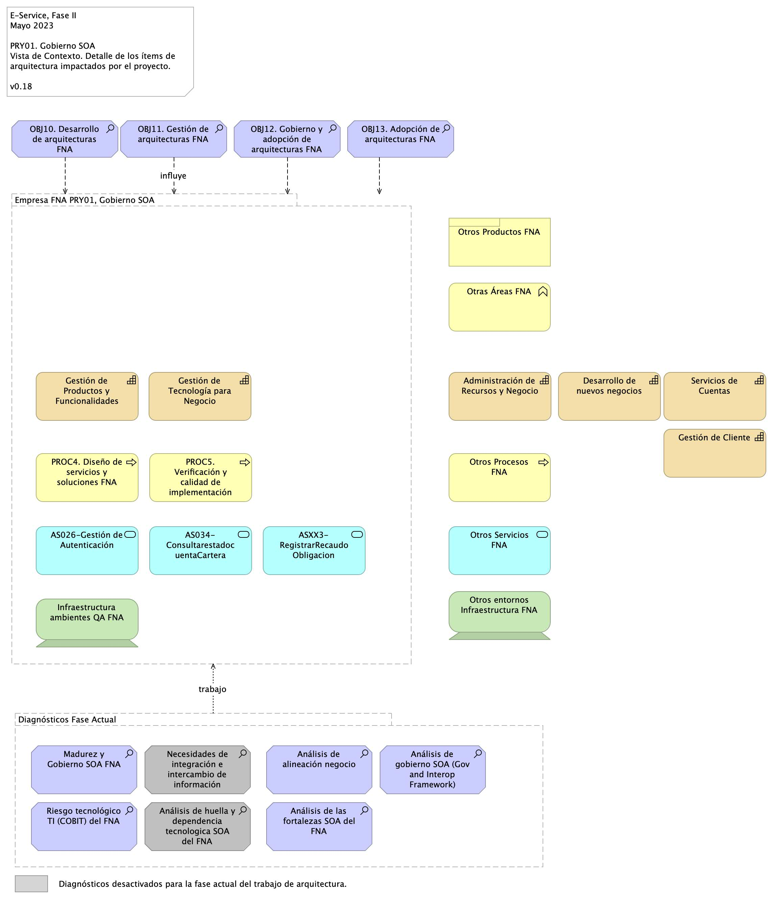

|Tema|Vista de Contexto: **Elementos de la Arquitectura Impactados por el Proyecto**|
|----|-----------------------------------------------------------------------|
|Palabras clave|SOA, Contexto, Áreas, Procesos, Objetivos
|Autor| |
|Fuente| |
|Version|$COMMIT del $FECHA_COMPILACION|
|Vínculos|[N001d. Ejecución Plan de Trabajo SOA](onenote:#N001d.sharepoint.com) [N003a. Procesos de Negocio FNA](onenote:#N003a.%20Procesos%20de%20Negocio%20FNA&section)|

 

# Vista de Contexto Fase II, E-Service, 2023 (181-2020)
## Elementos de la Arquitectura Impactados por el Proyecto
La vista de contexto o segmento de empresa presenta un corte de la arquitectura del Fondo Nacional del Ahorro (FNA, en adelante) acotada a las partes que son sujeto de trabajo de este proyecto, Gobierno SOA, Fase II, E-Service (contrato 181-2020). Si bien, la vista contiene aquellas partes directamente relacionadas con el proyecto, también presenta la relación indirecta que hay con otros ítems de la arquitectura del FNA.

 

[Imagen 1.]() Elementos de la arquitectura del FNA, la empresa, involucrados e impactados por el proyecto actual. Muestra además la relación indirecta con otras partes de la empresa, externas a la vista de contexto.

_Fuente: Elaboración propia._

 

Esta vista le informa al FNA tres objetivos importates. Primero, que el ejercicio actual, de gobierno SOA en esta caso, aunque sea de caracter empresarial está condicionada por las restricciones del proyecto presente, no puede por esto mismo abarcar a la completitud de la empresa. Por esta razón el segmento presentado en la imagen arriba hace foco en las partes que son relevantes según las restricciones de ejecución y resultados esperados de este proyecto. Segundo, la vista de contexto comunica las problemáticas y operaciones (en forma de trabajo, al final de la vista) que se deberán realizar para producir una solución esperada e los términos del proyecto, que en esta caso es de Gobierno SOA.

Tercero y último, facilita la justificación y los criterios con los que se realizó la inclusión de los ítems que en ella figuran.

 

## Justificación de los Ítems de Arquitectura Impactados por el Proyecto
En función a los resultados de los diagnósticos de E-Service, Fase Idel, específicamente de la evaluación de madurez de las dimensiones de arquitectura para el FNA, Negocio, Organización y Gobierno,
Método, Aplicaciones, Arquitectura, Información e Infraestructura; el FNA se encuentra en un nivel de madurez **REACTIVO** asociado a 
una gestión de información en modo aislado según las necesidades de cada área/sistema y por otra parte se encuentran soluciones específicas
para demandas puntuales.

En ese sentido, se hace necesario impactar los procesos que mayor presentan estas problemáticas en el Fondo, en función de mejorar la calidad de los servicios que presta, y en cumplimiento tanto de negocio (vicepresidencias de Crédito y vicepresidencia de Operaciones), como del marco normativo y evolución tecnológica que establece la _Política de Gobierno Digital_
del Ministerio de Tecnologías de la Información y las Comunicaciones. Y dentro de esos procesos misionales, las actividades asociadas a **Diseño de Servicios y Soluciones FNA** y **Verificación y Calidad de Implementación**,
constituyen elementos que habilitan al FNA, para una adecuada ruta de calidad de servicio y generación de valor para los interesados.

Estos elementos son abordados en el periodo de tiempo establecido para el ejercicio del proyecto, esto es _dos meses_, y con el equipo de trabajo presentado para su desarrollo.

Por otra parte; se hace necesario establecer los artefactos que son relevantes para la Entidad, en función de su misionalidad y las demandas 
de los interesados **ciudadanos**

## Descripción de los elementos de la vista de segmento

La vista de segmento que define los ítems de arquitectura del FNA a ser abordados en esta etapa del proyecto; comprenden los siguientes
elementos.

1. Los procesos de **Diseño de Servicios y Soluciones FNA** y **Verificación y Calidad de Implementación**
1. Los objetivos representados en el gobierno y adopción de la arquitectura
1. Los servicios derivados del **Diseño de Servicios y Soluciones FNA** y **Verificación y Calidad de Implementación**
1. La infraestructura tecnológica que soporta los servicios

### Diseño de Servicios y Soluciones FNA

El diseño de servicios y soluciones, constituye una competencia a desarrollar y madurar al interior del FNA, en concordancia con las
recomendaciones de los marcos de referencia: **e-Competence Framework (e-CF)—A common European Framework for ICT Professionals in all industry sectors—Part 1: Framework, 2016**
en los cuales la etapa de diseño está alineada con los requisitos de los servicios demandados por los interesados, su posterior desarrollo,
la adquisición/contratación y el gobierno que se hace necesario implementar para soportar la operación:

* Gestión de la configuración
* Preparación y ejecución de pruebas
* Gestión de Requisitos y Mantenimiento
* Atención de problemas
* Atención de incidentes

El Diseño de Servicios y Soluciones, garantiza una prestación ágil y escalable de servicios y soluciones digitales del FNA, además de oportunas y
rentables, capaces de apoyar los objetivos trazados en la vista de segmento de esta estapa del proyecto.

Estas soluciones digitales pueden adoptar varias formas, desde aplicaciones móviles, plataformas en línea, software personalizado,
y sistemas de gestión empresarial, entre otros.

Por otra parte y en articulación al Marco para la Transformación Digital del Estado Colombiano, del **MinTIC**, el diseño de servicios y
soluciones, integra habilidades del FNA, orientadas principalmente a:

* Diseño con enfoque centrado en los usuarios, (ciudadanos)
* Solución de problemas complejos a través de la Innovación
* Diseños Ágiles desde la perspectiva de salida a producción y con un adecuado uso de recursos

Estos elementos y características, corresponderán a los atributos del proceso ** Diseño de Servicios y Soluciones FNA **, de la vista de segmento
del FNA.

### Verificación y Calidad de Implementación

Este componente dentro de la vista de arquitectura de segmento, define el éxito del diseño de servicios y soluciones, debido a la consideración
de buenas prácticas, cumplimiento de normas y un adecuado gobierno en la etapa de diseño, hasta llegar a la implementación y puesta en funcionamiento.

La **Verificación y Calidad de Implementación** dentro de la arquitectura de segmento, asegura que el diseño tuvo una planificación adecuada, un
equipo de trabajo con las competencias necesarias, una comunicación acertiva, un modelo de desarrollo y ejecución de pruebas, un mecanismo gradual de
implementación, las respectivas capacitaciones, los requerimientos de seguridad y privacidad y la generación de hábitos y comportamientos a través del
uso y apropiación de la solución desplegada.

Lo anterior sugiere los niveles de actuación de un gobierno; **Gobierno SOA**

Dentro del alcance de esta fase del proyecto, se contempla el diseño del Gobierno SOA, compuesto por elementos con
líneas de actuación en completa articulación; los resultados de uno, impactan los resultados y el accionar de los demás.

Estos elementos que se relacionan a continuación:
 
* Procesos
* Estructura
* Habilidades y Competencias
* Políticas
* Cultura y Ética
* Infraestructura
* Elementos de Información

### Desarrollo de Arquitecturas FNA

Dentro del dominio motivacional; una de las metas claves de la vista de segmento corresponde al desarrollo de arquitecturas, como
elementos rectores de gobierno de los procesos: **Diseño de Servicios y Soluciones FNA** y **Verificación y Calidad de Implementación**

De acuerdo al Marco de Referencia de Arquitectura Empresarial - **MRAE** del MinTIC es necesario generar una articulación entre: las
iniciativas que se generan desde los dos procesos que son parte del alcance de esta fase; la ejecución de los proyectos que se generaron
a partir de aquellas iniciativas; y una gestión y monitoreo de los impactos de la finalización de los proyectos y los productos que 
entregan a nivel de servicios.

A través de la práctica de arquitectura, el FNA empieza a generar un gobierno del diseño y posterior implmentación de los servicios
y soluciones digitales que presta a los ciudadanos.

### Gestión de Arquitectura FNA**
Este componente está orientado a la instauración del Gobierno de Arquitectura; con los elementos que lo componen: procesos, estructura,
habilidades y competencias, políticas, cultura y ëtica, y elementos de información.

Es un objetivo a cumplir para los procesos definnidos en esta fase: _Diseño de Servicios y Soluciones FNA_ y _Verificación y Calidad de Implementación_.

