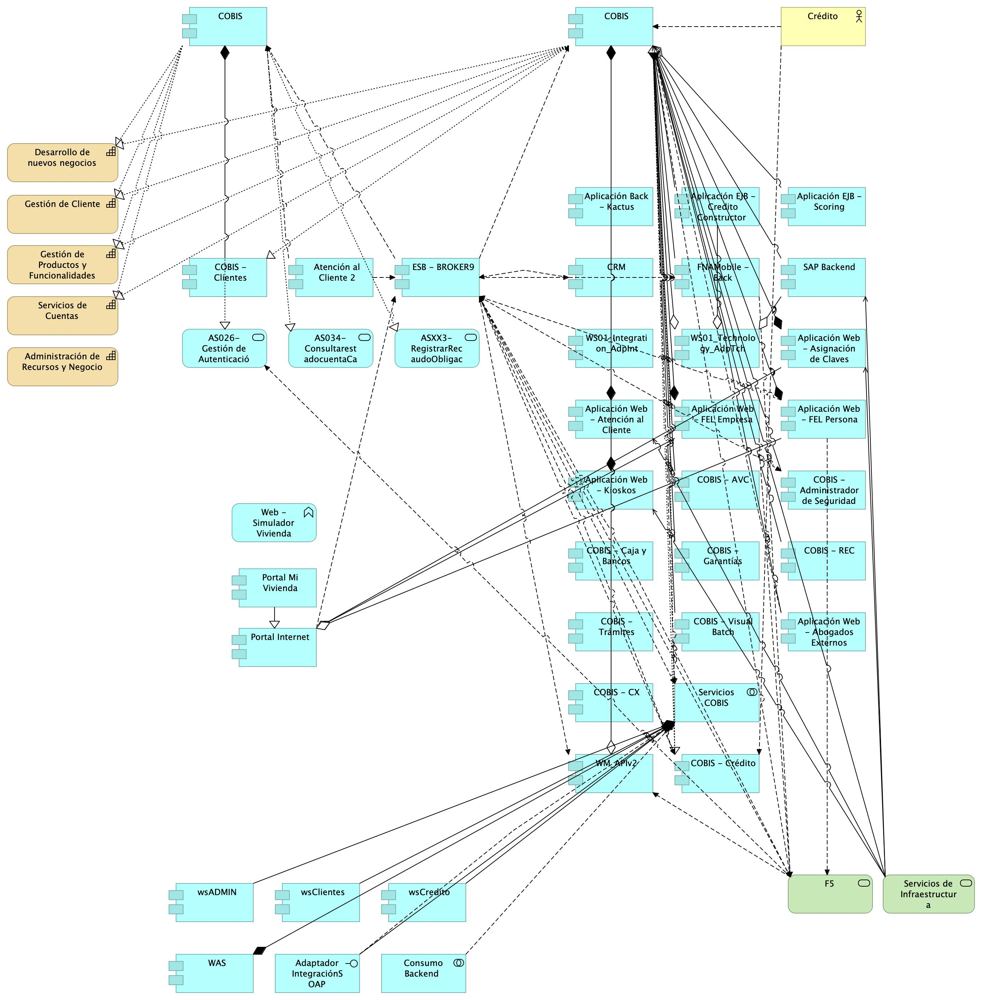

| Tema           | Justificación Segmento Empresa FNA: **Elementos de la Arquitectura Impactados por el Proyecto** |
|----------------|------------------------------------------------------------------------|
| Palabras clave | SOA, Contexto, Áreas, Procesos, Objetivos                              |
| Autor          |                                                                        |
| Fuente         |                                                                        |
| Version        | 1.$COMMIT del $FECHA_COMPILACION                                       |
|Vínculos|[Ejecución Plan de Trabajo SOA](onenote:#N001d.sharepoint.com) [Resultados y métricas del diagnóstico de madurez SOA](onenote:#N003a.%20Procesos%20de%20Negocio%20FNA&section)|

 

## Justificación de los Ítems de Arquitectura Impactados por el Proyecto
El resultado de los diagnósticos de E-Service, Fase I, específicamente de la evaluación de madurez de SOA del FNA, y los dominios ahí analizados de Negocio, Organización y Gobierno, Método, Aplicaciones, Arquitectura, Información e Infraestructura, ubica al FNA en un nivel de madurez Nivel 2, _REALIZADO_[^1], tal que implica una operación reactiva asociada a una gestión de información en modo aislado en cuanto a las necesidades de cada área de negocio y sus sistemas de información, y que el mismo diagnóstico encuentra que el FNA incurre en soluciones específicas para demandas puntuales (Ver _Resultados y métricas del diagnóstico de madurez SOA_, en E-Service, Fase I).

[^1]: OSIMM, Realizado. El nivel 2 de madurez de OSIMM, _Realizado_, implica además que la empresa es reactiva, información en silos, y procedimientos ad hocs contrarios a procedimientos sistemáticos.

Partiendo de este resultado, se hace necesario impactar los ítems de la empresa FNA relacionados con las causas indicadas en el diagnóstico de madurez del Fondo, en pro del gobieno SOA, objeto de este proyecto, y de mejorar la calidad de las soluciones de software que están detrás y soportan a los servicios de cliente final que la entidad presta, que a su vez van en cumplimiento tanto del negocio (vicepresidencias de Crédito y vicepresidencia de Operaciones), como del marco normativo y evolución tecnológica que establece la _Política de Gobierno Digital_ del MinTIC Colombia. Por este motivo, las actividades asociadas con los procesos _(PROC4). Diseño de servicios y soluciones FNA_, y _(PROC5). Verificación y Calidad de Implementación_, constituyen elementos que habilitan en el FNA la implementación del gobierno SOA, la vigilancia de la calidad de los servicios misionales del FNA y la generación de valor.

|                             |                                  |
|-----------------------------|----------------------------------|
|  |  |

[Imagen.]() Resultados y métricas del diagnóstico de madurez SOA. Todos los dominios.

_Fuente: Diagnóstico SOA. E-Service (2022)_

 

Al igual que los procesos PROC4 y PROC5, arriba mencionados, otros elementos involucrados en el diseño del gobierno SOA del FNA son requerdidos por el proyecto. Estos otros elementos, y sus artefactos de tecnología directamente relacionados se encuentran contenidos en la vista de segmento de la empresa FNA (ver _Vista de Contexto: Elementos de la Arquitectura Impactados por el Proyecto_).

Los elementos de la vista de segmento, que como ítems impactados por el gobierno SOA, objeto de este proyecto, ameritan ser resaltados son las capacidades de negocio del FNA: Gestión de Tecnología para Negocio, y Gestión de Productos y Funcionalidades (ver imagen abajo), son de importancia por su directa relación con los procesos PROC4 y PROC5, incluidos con anterioridad en el segmento de la empresa a trabajar, y porque además, estas unen a los procesos con los servicios más relevantes para esta etapa del diseño del gobierno del FNA. La imagen siguiente demuestra esta relación entre los procesos y los servicios SOA del FNA relacionadas con las capacidades que el gobierno FNA busca impactar.

 

[Imagen.]() Capacidades de negocio FNA que el gobierno SOA del FNA, objeto de este proyecto, busca impactar.

_Fuente: Diagnóstico SOA. E-Service (2022)_

 

Todos los elementos de la empresa contenidos en la vista de contexto, o segmento de la empresa FNA, serán abordados en el periodo de tiempo establecido para el ejercicio del proyecto, esto es, _dos meses_, contados desde la firma del inicio de proyecto, y con el equipo de trabajo presentado para la ejecución del presente proyecto (PRY01).

 

## Descripción de los elementos de la vista de segmento

La vista de segmento que define los ítems de arquitectura del FNA a ser abordados en esta etapa del proyecto; comprenden los siguientes
elementos.

1. Los procesos de _Diseño de Servicios y Soluciones FNA** y **Verificación y Calidad de Implementación_
1. Los objetivos representados en el gobierno y adopción de la arquitectura
1. Los servicios derivados del _Diseño de Servicios y Soluciones FNA_ y _Verificación y Calidad de Implementación_
1. La infraestructura tecnológica que soporta los servicios

 

### Diseño de Servicios y Soluciones FNA
El diseño de servicios y soluciones, constituye una competencia a desarrollar y madurar al interior del FNA, en concordancia con las recomendaciones de los marcos de referencia: _e-Competence Framework (e-CF)—A common European Framework for ICT Professionals in all industry sectors—Part 1: Framework, 2016_
en los cuales la etapa de diseño está alineada con los requisitos de los servicios demandados por los interesados, su posterior desarrollo, la adquisición o contratación y el gobierno que se hace necesario implementar para soportar la operación:

* Gestión de la configuración
* Preparación y ejecución de pruebas
* Gestión de Requisitos y Mantenimiento
* Atención de problemas
* Atención de incidentes

El Diseño de Servicios y Soluciones, garantiza una prestación ágil y escalable de servicios y soluciones digitales del FNA, además de oportunas y
rentables, capaces de apoyar los objetivos trazados en la vista de segmento de esta estapa del proyecto.

Estas soluciones digitales pueden adoptar varias formas, desde aplicaciones móviles, plataformas en línea, software personalizado,
y sistemas de gestión empresarial, entre otros.

Por otra parte y en articulación al Marco para la Transformación Digital del Estado Colombiano, del **MinTIC**, el diseño de servicios y
soluciones, integra habilidades del FNA, orientadas principalmente a:

* Diseño con enfoque centrado en los usuarios, (ciudadanos)
* Solución de problemas complejos a través de la Innovación
* Diseños Ágiles desde la perspectiva de salida a producción y con un adecuado uso de recursos

Estos elementos y características, corresponderán a los atributos del proceso ** Diseño de Servicios y Soluciones FNA **, de la vista de segmento
del FNA.

### Verificación y Calidad de Implementación

Este componente dentro de la vista de arquitectura de segmento, define el éxito del diseño de servicios y soluciones, debido a la consideración
de buenas prácticas, cumplimiento de normas y un adecuado gobierno en la etapa de diseño, hasta llegar a la implementación y puesta en funcionamiento.

La **Verificación y Calidad de Implementación** dentro de la arquitectura de segmento, asegura que el diseño tuvo una planificación adecuada, un
equipo de trabajo con las competencias necesarias, una comunicación acertiva, un modelo de desarrollo y ejecución de pruebas, un mecanismo gradual de
implementación, las respectivas capacitaciones, los requerimientos de seguridad y privacidad y la generación de hábitos y comportamientos a través del
uso y apropiación de la solución desplegada.

Lo anterior sugiere los niveles de actuación de un gobierno; **Gobierno SOA**

Dentro del alcance de esta fase del proyecto, se contempla el diseño del Gobierno SOA, compuesto por elementos con
líneas de actuación en completa articulación; los resultados de uno, impactan los resultados y el accionar de los demás.

Estos elementos que se relacionan a continuación:
 
* Procesos
* Estructura
* Habilidades y Competencias
* Políticas
* Cultura y Ética
* Infraestructura
* Elementos de Información

 

### Desarrollo de Arquitecturas FNA
Dentro del dominio motivacional; una de las metas claves de la vista de segmento corresponde al desarrollo de arquitecturas, como
elementos rectores de gobierno de los procesos: **Diseño de Servicios y Soluciones FNA** y **Verificación y Calidad de Implementación**

De acuerdo al Marco de Referencia de Arquitectura Empresarial - **MRAE** del MinTIC es necesario generar una articulación entre: las iniciativas que se generan desde los dos procesos que son parte del alcance de esta fase; la ejecución de los proyectos que se generaron a partir de aquellas iniciativas; y una gestión y monitoreo de los impactos de la finalización de los proyectos y los productos que 
entregan a nivel de servicios.

A través de la práctica de arquitectura, el FNA empieza a generar un gobierno del diseño y posterior implmentación de los servicios y soluciones digitales que presta a los ciudadanos.

### Gestión de Arquitectura FNA
Este componente está orientado a la instauración del Gobierno de Arquitectura; con los elementos que lo componen: procesos, estructura, habilidades y competencias, políticas, cultura y ëtica, y elementos de información.

Es un objetivo a cumplir para los procesos definnidos en esta fase: _Diseño de Servicios y Soluciones FNA_ y _Verificación y Calidad de Implementación_.

 
