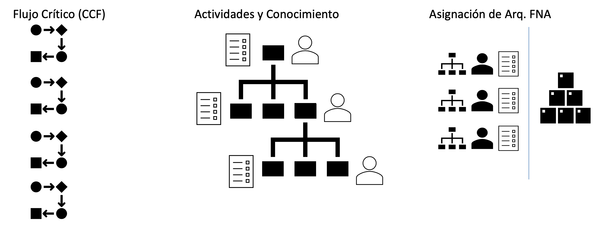

| Tema           | Flujos Críticos de Trabajo FNA: **Elementos Susceptibles de Gobierno en el FNA**  |
|----------------|-----------------------------------------------------------------------|
| Palabras clave | SOA, Flujos críticos, Procesos, Gobierno                              |
| Autor          |                                                                       |
| Fuente         | Elaboración propia                                                    |
| Version        | 1.$COMMIT del $FECHA_COMPILACION                                      |
| Vínculos       | [N001d. Ejecución Plan de Trabajo SOA](onenote:#N001d.sharepoint.com); [N003a. Procesos de Negocio FNA](onenote:#N003a.%20Procesos%20de%20Negocio%20FNA&section) |

 

# Flujos Críticos Susceptibles de Gobierno FNA
Los flujos críticos proporcionan dos tipos de información valiosa: la manera en que funcionan las cosas dentro del FNA, y qué las causas y debilidades de estas. Además, de esta información, sirven de insumo para la deducción (método deductivo) de ex ante de fómulas y prácticas de gobierno SOA del FNA, objeto de este proyecto.

 

## Plantilla de Realización del Flujo Crítico
Para facilitar la recolección de los flujos críticos, presentamos la siguiente plantilla personalizada para el FNA.

* Encabezado: describir el dueño del flujo.
* Atención: cómo o dónde inicia el flujo.
* Petición: registro de la petición.
* Arquitectura: pasos del flujo en los que participa el arquitecto.
* Valor: valor que este flujo genera para el FNA.
* Seguimiento: validación de la generación de valor.
* Entrega: entregado del resultado del flujo.
* Repetición: consideaciones de mejora.

**Nota**: para más información del uso y apropiación de la herramienta Flujo Crítifo de Trabajo, ver el anexo _CCF_, más adelante.

 

## Análisis de los Flujos de Trabajo
Los flujos serán analizados desde tres perspectivas ilustradas a continuación.

{#fig: width=lin}

_Fuente: Elaboración propia._

 
