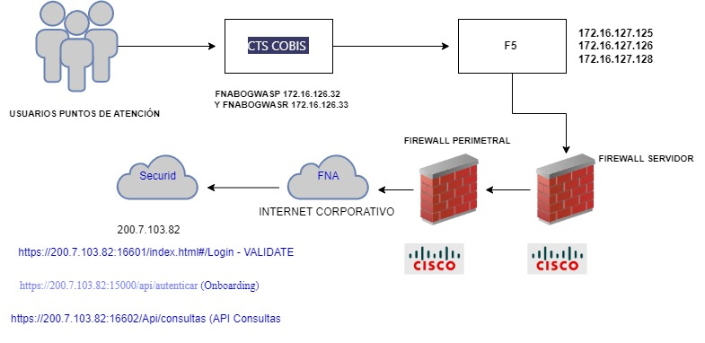

## CCF. Flujo Crítico Trabajo: 01. Biometría FNA
Aprobación de cesantías FNA.

 

| CCF                |     |
|--------------------|-----|
| Cliente destino:   | Fondo Nacional del Ahorro 
| Producto/Servicio: | Biometria 

 

### Atención
El consumidor financiero del FNA, se acerca a los puntos de atención para retiro de cesantias y/o AVC dentro del proceso se le capturan las huellas por dónde llega o inicia el flujo. 

### Petición
Los registros de biometria son entregados por el operador biometrico a traves de correo electronico al usuario lider del area 

### Arquitectura
- paso 1 cobis envia un ID al operador biometrico 
- paso 2 el operador biometrico responde el ID 
- paso 3 El operador levanta el servicio 
- paso 4 El aplicativo core envía la petición de biometria 
- el operador biometrico responde con un hit o no hit (hit que quiere decir que la persona es quien dice ser, no hit no es quien dice ser)

Notas: excepcion de los casos de uso, exhaustividad de las pruebas, la confiabilidad de las pruebas, Malla de calidad de las pruebas, fortalecimiento de diseño, categoria: Alta 
caso de uso: excepciones.

### Valor
El valor es alto, debido a que afecta al consumidor financiero en el retiro de las cesantias 

### Seguimiento
El seguimiento se realiza diariamente con la conciliación aplicada por el área usuaria.

### Entrega
El resultado del trabajo es la implementacion de herramientas de gobierno que permitan el fortalecimiento en el diseño para la aplicacion 

### Repetición
Implementar un buen diseño en la aplicacion y malla de calidad en la pruebas.

### Anexo. Diagrama del flujo
 

[Imagen.]() Flujo de trabajo crítico, aprobación de censatía con biometría FNA, para el análisis de las fortalezas, debilidades, y otras consideraciones de gobierno SOA del FNA.

_Fuente: elaboración propia._

 
