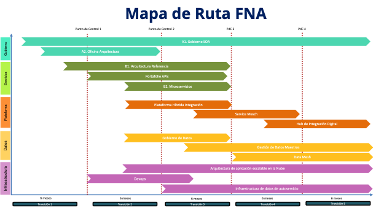

## Hoja de Ruta E-Service FNA (Arquitectura E-Service)
Los proyectos de la hoja de ruta resultado de la ejecución de la consultoría "Arquitectura E-Service", dentro del proyecto PETI, son los siguientes:

1. Gobierno SOA
1. Oficina de arquitectura
1. Arquitectura de referencia 2.0
1. Portafolio API
1. Microservicios
1. Plataforma híbrida de integración
1. Service mesh
1. Hub de integración digital
1. Gobierno de datos
1. Gestión de datos maestros
1. Arquitectura de datos (data mesh)
1. Devops
1. Infraestructura escalable nube
1. Infraestructura autoservicio de datos

 

La secuencia, la dependencia y los plazos estimados de los proyectos de la hoja de ruta E-Service FNA es la indicada en la siguiente imagen.

[Imagen 1.]() Proyectos de cierre de brecha FNA. Prioridades, dependencias, secuencia, puntos de control de la evolución de la arquitectura de referencia SOA 2.0 del Fondo.

_Fuente: Consultoría Arquitectura E-Service._

 

