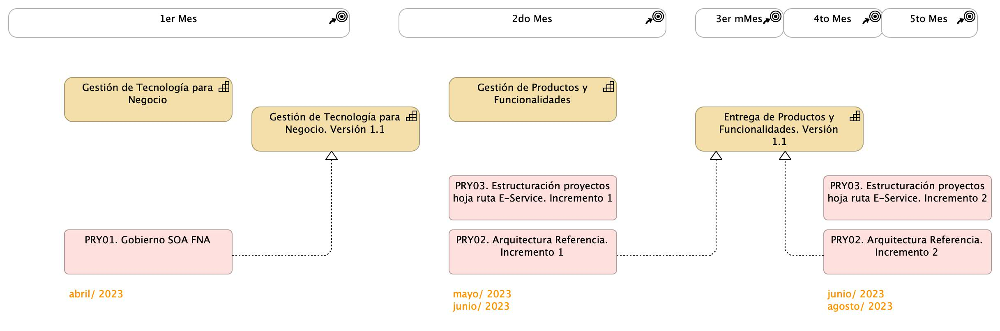

## Alcance de la primera ejecución de la hoja de ruta E-Service
Para el período 2023, la implementación de la hoja de ruta E-Service impactará los objetivos de Flexibilidad (OBJ3) y Fortalecimiento (OBJ2), mediante el incremento de las capacidades del FNA 
de Gestión de tecnología (CAP1) y de Entrega de productos y funcionalidades (CAP2), _en el dominio de aplicaciones y servicios únicamente_ (restricción de alcance). Esto implica la planeación, ejecución y seguimiento de los proyectos siguientes:

* PRY01. Gobierno SOA FNA: dominio de aplicaciones y servicios únicamente
* PRY02. Arquitectura Referencia: dominio de aplicaciones y servicios únicamente
* PRY03. Estructuración de proyectos posteriores de la hoja de ruta E-Service

 

El alcance de la primera ejecución de la hoja de ruta E-Service es el ilustrado a continuación.

[Imagen 1.]() Vista de evolución de capacidades dentro del alcance del proyecto hoja de ruta E-Service, período 2023, dominio de aplicaciones y servicios. Capacidades incrementadas para impactar a los objetivos Flexibilidad (OBJ3) y Fortalecimiento (OBJ2).

 
