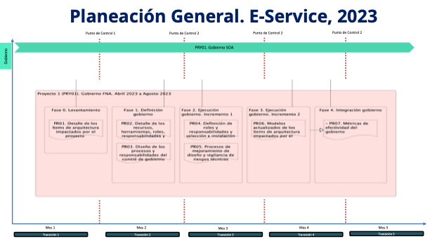

## Plan General de la Propuesta
La siguiente imagen presenta a manera de referencia el plan general en el tiempo de los tres proyectos contenidos en el alcance de esta propuesta. Nota: los plazos en la imagen son referenciales. Los plazos reales de cada proyecto, por separado, serán determinados y aceptados en las fases de levantamiento de cada uno.

[Imagen 2.]() Vista de tiempo de ejecución de los proyectos de cierre de brecha de la hoja de ruta E-Service consignados en el alcance de esta propuesta, para el período de 5 meses, en el 2023.

 

La planeación general no contiene fases ni entregables. En su lugar, cada proyecto (PRY01... 03) dentro de la planeación general es independiente y contiene fases, fechas, actividades y productos de trabajo por separado. La planeación de cada proyecto es como sigue.

[Imagen.]() Vista de tiempo de ejecución del proyecto 01 de cierre de brecha, _PRY01. Gobierno SOA FNA_, de la hoja de ruta E-Service consignados en el alcance de esta propuesta, para el período de 5 meses, en el 2023.

[Imagen.]() Vista de tiempo de ejecución del proyecto 02 de cierre de brecha, _PRY02. Arquitectura Referencia_, de la hoja de ruta E-Service consignados en el alcance de esta propuesta, para el período de 5 meses, en el 2023.

[Imagen.]() Vista de tiempo de ejecución del proyecto 03 de cierre de brecha, _PRY03. Estructuración de proyectos_, de la hoja de ruta E-Service consignados en el alcance de esta propuesta, para el período de 5 meses, en el 2023.

 
