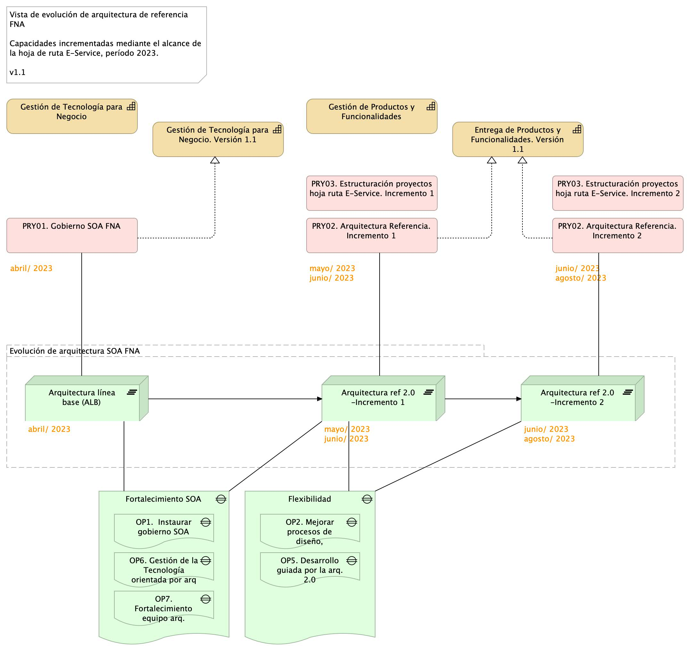

## Proyectos del Alcance
Los proyectos PRY01, PRY02 y PRY03 de la hoja de ruta consignados en arriba en el alcance tienen por objeto impactar las brechas Fortaleza SOA (OBJ2) y Flexibilidad y riesgos técnicos (OBJ3) determinados en el diagnóstico de la consultoría "Arquitectura E-Service". 

Estos proyectos buscan también incrementar las capacidades del FNA, Gestión de tecnología y de Entrega de productos y funcionalidades (CAP1 y CAP2, respectivamente), mencionadas en el alcance y estructurar el detalle técnico y tecnológico de los proyectos futuros planteadas en dicha hoja de ruta.

Las capacidades, las brechas y los proyectos de este alcance se encuentran relacionadas en la imagen siguiente. En la imagen se ve además el impacto (evolución) que este alcance causa en la arquitectura de referencia del FNA.

[Imagen 2.]() Vista de evolución de arquitectura de referencia FNA a razón de las capacidades incrementadas mediante los proyectos de este alcance.

 

La evolución de la arquitectura del FNA impactada mediante este alcance está organizada en dos incrementos.

### Arquitectura de referencia 2.0. Incremento 1
Versión mejorada de arquitectura actual SOA FNA con soporte en implementación parcial del gobierno y definiciones iniciales de la arquitectura de referencia SOA 2.0. Aplicación de arquitectura de referencia inicial a ítems seleccionados en una fase de levantamiento (LVT).

### Arquitectura de referencia 2.0. Incremento 2
Continuidad de la mejora del incremento 1. La arquitectura SOA FNA cuenta con implementación total del gobierno, una definición candidata de la arquitectura de referencia 2.0, y aplicación de los cambios en ítems adicionales al incremente 1 de la arquitectura actual.

La imagen 2 presentada anteriormente ilustra el alcance propuesto en términos de las capacidades del FNA impactadas, los proyectos de ejecución, las evoluciones de la arquitectura y las brechas involucradas. 

A continuación presentamos la descripción de los proyectos de este alcance en forma de fichas de proyecto. 

 
