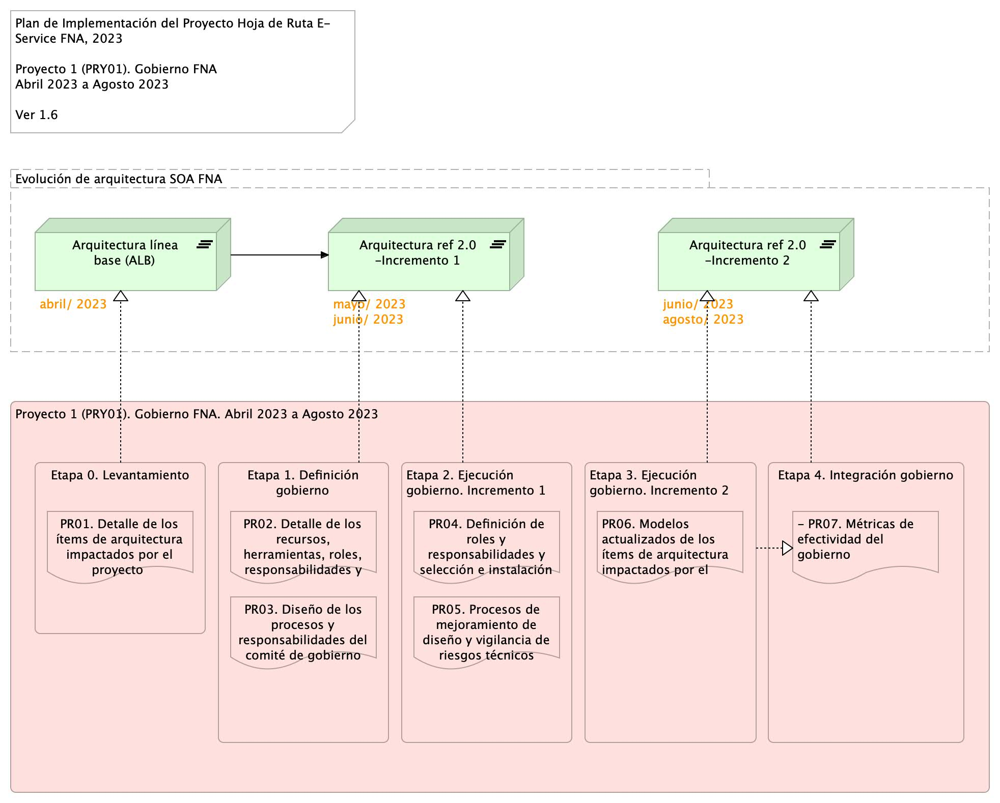

#### Plan de Trabajo
Organización de trabajo: El proyecto 1 (PRY01) está organizado en 4 fases. La fase de Levantamiento (LVT) presentada abajo en la imagen determina en detalle los elementos de gobierno y de la arquitectura que se evolucionarán en los dos incrementos planteados en los proyectos del alcance consignado arriba, y que se corresponden con las fases 2 y 3 de la plan siguiente.

[Imagen.]() Plan de Implementación del Proyecto Hoja de Ruta E-Service FNA, 2023. Abril 2023 a Dic 2023. Ver 1.0

#### Fases del proyecto
La fase 1, Definición del Gobierno, diseña y determina los procesos de gestión de mejoramiento de la arquitectura SOA y la vigilancia de riesgo técnico que regirán en adelante en el FNA. Estos mismo procesos de gobierno aplican en las fases sucesivas del proyecto.

Las fases 2 y 3, implantan el gobierno anteriormente definido, e impactan directamente a los modelos y las decisiones de la arquitectura SOA del FNA, esto es, sistemas de información, herramientas de software, servicios, o componentes seleccionados en la fase Levantamiento.

Finalmente, la fase 4 se encarga de ejecutar los indicadores de medición de desempeño, tanto del gobierno como de los incrementos de evolución de la arquitectura de referencia 2.0 (ver resultados del diagnóstico E-Service, 2022).

#### Plazo de Ejecución
El plazo de ejecución, contado desde la firma del contrato y de la autorización de todas las partes, es de 5 meses, o su equivalente en horas

    180 hrs/mes * 5 meses = 910 hrs / hombre proyecto

 
