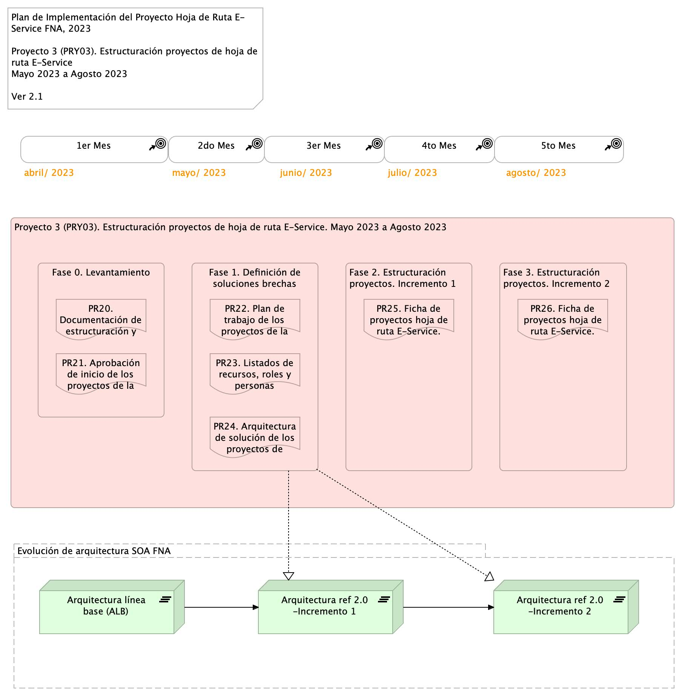

#### Plan de Trabajo
Organización de trabajo: el proyecto 3 (PRY03) inicia con la fase de Levantamiento (LVT) de los proyectos por implementar de la hoja de ruta E-Service, en coordinación con las áreas de negocio y tecnología del FNA involucradas en cada proyecto. Se determinan los detalles de los elementos de la arquitectura a impactar.

[Imagen.]() Plan de Implementación del Proyecto Hoja de Ruta E-Service FNA, 2023. Abril 2023 a Dic 2023.

#### Fases del proyecto
Las fases 1 detalla las soluciones de los proyectos de cierre de brechas que confirman la hoja de ruta E-Service por implementar. Trata de los componentes, partes de la arquitectura de referencia 2.0, herramientas, métodos, diseños y tecnologías requeridas para la implementación y ejecución de dichos proyectos de cierre de brecha.

Las fases 2 y 3, de estructuración, agregan la información de la organización, ejecución y seguimiento de los proyectos de solución definidos en la fase anterior.

#### Plazo de Ejecución
El plazo de ejecución, contado desde la firma del contrato y de la autorización de todas las partes, es de 4 meses, o su equivalente en horas

    180 hrs/mes * 4 meses = 720 hrs / hombre proyecto

 

