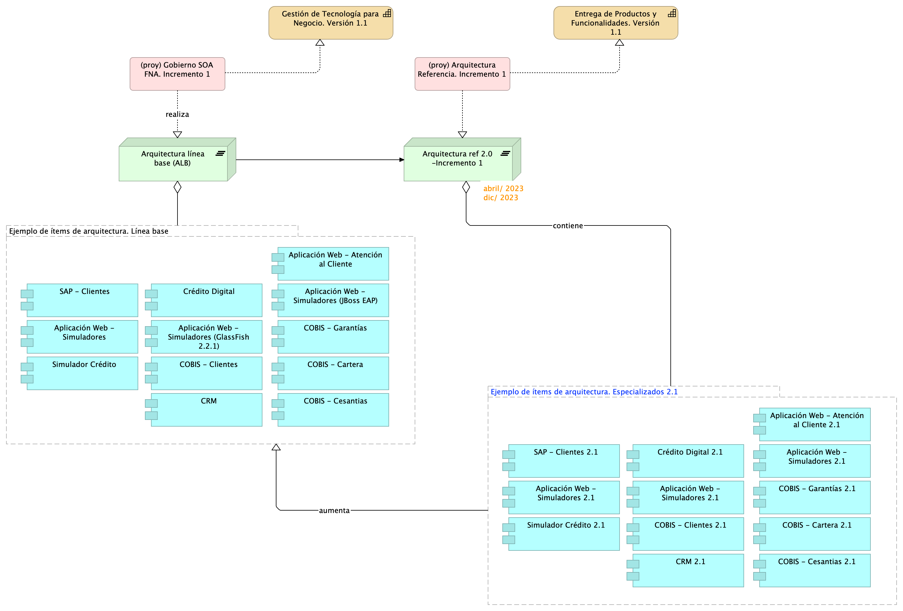

## Componentes de la Arquitectura FNA Impactados
Los aumentos de versión de la arquitectura SOA del FNA implica ítems de trabajo, componentes de software, aplicaciones, tecnologías o recursos de capital humano deban ser modificados (aumentado de versión).

Con propósito únicamente ilustrativo de los ítems que pueden ser sujetos de variante (especialización) por concepto de los incrementos de la arquitectura del FNA, dominio de aplicaciones y servicios únicamente, bajo las condiciones de tiempo y recursos del proyecto de implementación de hoja de ruta E-Service, período 2023, presentamos a continuación una lista de aplicaciones de software que pueden llegar a cambiar (otros ítems no presentes en este ejemplo pueden ser impactados).

[Imagen 2.]() Aplicaciones de software del FNA involucrados en los incrementos de versión de la arquitectura de referencia.

 

