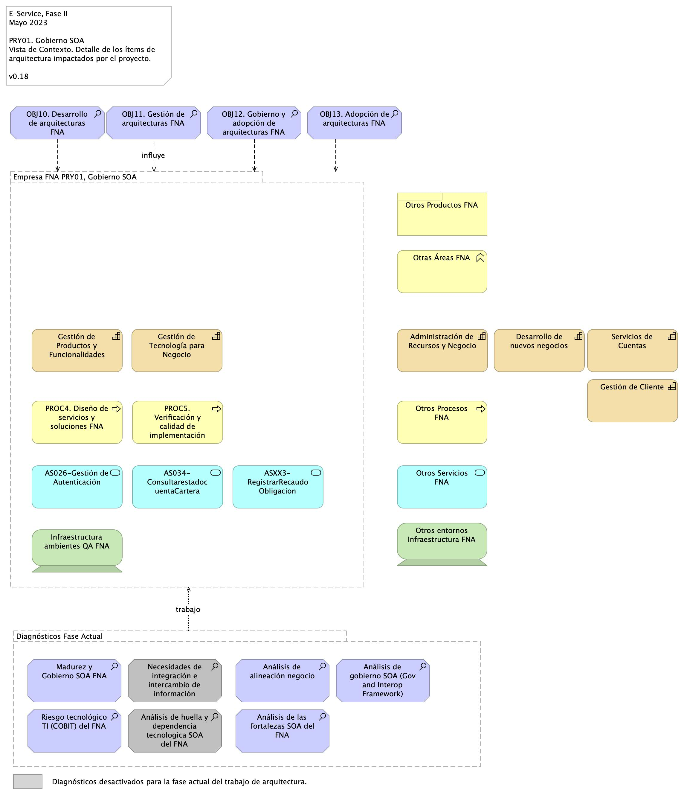
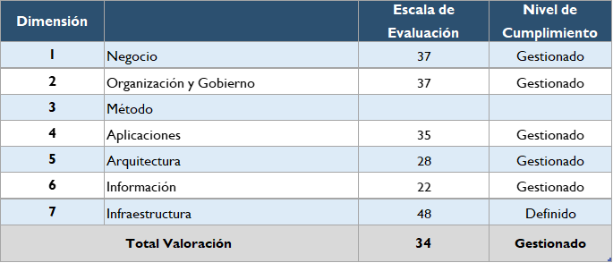
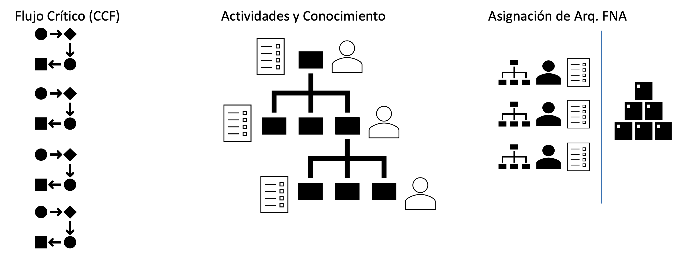

title: Vista de Contexto
geometry:
  - top=1in
  - bottom=1in
fignos-cleveref: True
fignos-plus-name: Fig.
fignos-caption-name: Imagen
...

| Tema           | Vista de Contexto: **Elementos de la Arquitectura Impactados por el Proyecto** |
|----------------|--------------------------------------------------------------------------------|
| Palabras clave | SOA, Contexto, Áreas, Procesos, Objetivos                                      |
| Autor          |                                                                                |
| Fuente         |                                                                                |
| Version        | 1.051c39d del 06 Jun 2023                                               |
| Vínculos       | [N001d. Ejecución Plan de Trabajo SOA](onenote:#N001d.sharepoint.com); 
                   [N003a. Procesos de Negocio FNA](onenote:#N003a.%20Procesos%20de%20Negocio%20FNA&section)|

 

# Vista de Contexto Fase II, E-Service, 2023 (181-2020)
## Elementos de la Arquitectura Impactados por el Proyecto
La vista de contexto o del segmento de empresa presenta un corte de la arquitectura del Fondo Nacional del Ahorro (FNA, en adelante) que será abordada por este proyecto. Por tanto, esta vista es una porción de la empresa FNA (segmento de empresa) acotada a las partes que son sujeto del trabajo del proyecto PRY01, Gobierno SOA, Fase II, E-Service (contrato 181-2020). Si bien, la vista contiene aquellas partes directamente relacionadas con el proyecto, también presenta en relación indirecta a otros ítems de la arquitectura del FNA.

La vista de segmento a continuación escoge las partes de la arquitectura del FNA que son sujeto del alcance del PRY01, Gobierno SOA del FNA.

{#fig:1 width=lin}

_Fuente: Elaboración propia._

 

Esta vista le informa al FNA tres objetivos importates. Primero, que el ejercicio actual, de gobierno SOA, aunque sea de caracter empresarial está condicionada por las restricciones del proyecto presente, y no debe por esto mismo abarcar la completitud de la empresa FNA, si no, únicamente las partes seleccionados como relevantes (ver [Justificación Segmento Empresa FNA](URL.com), más adelante). Por esta razón, el segmento presentado en la imagen arriba hace foco en las dichas capacidades del FNA, en esos procesos, y en tales servicios que son relevantes según las restricciones de ejecución y resultados esperados de este proyecto. 

Segundo, la vista de contexto comunica las problemáticas y operaciones a realizar a aquellas partes de la empresa FNA (aparecen en forma de trabajo, al final de la vista). Estas operaciones, en forma de diagnósticos, por ej., se deberán realizar para producir una solución dentro de los términos del proyecto, que en esta caso, es el de Gobierno SOA.

Tercero y último, la vista de segmento FNA del proyecto facilita la justificación y los criterios con los que se realizó la inclusión estos, y nuevos ítems que esta incluya.

 

## Descripción de los Elementos de la Vista de Segmento
La vista de segmento que define los ítems de arquitectura del FNA a ser abordados en esta etapa del proyecto; comprenden los siguientes
elementos.

1. Los procesos de _Diseño de Servicios y Soluciones FNA** y **Verificación y Calidad de Implementación_
1. Los objetivos representados en el gobierno y adopción de la arquitectura
1. Los servicios derivados del _Diseño de Servicios y Soluciones FNA_ y _Verificación y Calidad de Implementación_
1. La infraestructura tecnológica que soporta los servicios

 

### PROC4. Diseño de Servicios y Soluciones FNA
El diseño de servicios y soluciones, constituye una competencia a desarrollar y madurar al interior del FNA, en concordancia con las recomendaciones de los marcos de referencia: _e-Competence Framework (e-CF)—A common European Framework for ICT Professionals in all industry sectors—Part 1: Framework, 2016_ en los cuales la etapa de diseño está alineada con los requisitos de los servicios demandados por los interesados, su posterior desarrollo, la adquisición o contratación y el gobierno que se hace necesario implementar para soportar la operación:

* Gestión de la configuración
* Preparación y ejecución de pruebas
* Gestión de Requisitos y Mantenimiento
* Atención de problemas
* Atención de incidentes

El Diseño de Servicios y Soluciones, garantiza una prestación ágil y escalable de servicios y soluciones digitales del FNA, además de oportunas y rentables, capaces de apoyar los objetivos trazados en la vista de segmento de esta estapa del proyecto.

Estas soluciones digitales pueden adoptar varias formas, desde aplicaciones móviles, plataformas en línea, software personalizado, y sistemas de gestión empresarial, entre otros.

Por otra parte y en articulación al Marco para la Transformación Digital del Estado Colombiano, del MinTIC, el diseño de servicios y soluciones, integra habilidades del FNA, orientadas principalmente a lo siguiente.

* Diseño con enfoque centrado en los usuarios beneficiarios del FNA
* Solución de problemas complejos a través de la arquitectura
* Diseños ágil desde la perspectiva de salida a producción y con un adecuado uso de recursos

Estos elementos y características, corresponderán a los atributos del proceso Diseño de Servicios y Soluciones FNA, de la vista de segmento del FNA.

### PROC5. Verificación y Calidad de Implementación
Este componente dentro de la vista de arquitectura de segmento, define el éxito del diseño de servicios y soluciones, debido a la consideración de buenas prácticas, cumplimiento de normas y un adecuado gobierno en la etapa de diseño, hasta llegar a la implementación y puesta en funcionamiento.

La verificación y calidad de implementación dentro de la arquitectura de segmento, asegura que el diseño tuvo una planificación adecuada, un equipo de trabajo con las competencias necesarias, una comunicación acertiva, un modelo de desarrollo y ejecución de pruebas, un mecanismo gradual de
implementación, las respectivas capacitaciones, los requerimientos de seguridad y privacidad y la generación de hábitos y comportamientos a través del uso y apropiación de la solución desplegada.

Dentro del alcance de esta fase del proyecto, se contempla el diseño del Gobierno SOA, compuesto por elementos con líneas de actuación en completa articulación; los resultados de uno, impactan los resultados y el accionar de los demás.

Estos elementos que se relacionan a continuación:
 
* Procesos
* Estructura
* Habilidades y Competencias
* Políticas
* Cultura y Ética
* Infraestructura
* Elementos de Información\ 

 

### OBJ10. Desarrollo de Arquitecturas FNA
Dentro del dominio motivacional; una de las metas claves de la vista de segmento corresponde al desarrollo de arquitecturas, como elementos rectores de gobierno de los procesos: _Diseño de Servicios y Soluciones FNA_ y _Verificación y Calidad de Implementación_.

De acuerdo al Marco de Referencia de Arquitectura Empresarial (MRAE) del MinTIC es necesario generar una articulación entre: las iniciativas que se generan desde los dos procesos que son parte del alcance de esta fase; la ejecución de los proyectos que se generaron a partir de aquellas iniciativas; y una gestión y monitoreo de los impactos de la finalización de los proyectos y los productos que 
entregan a nivel de servicios.

A través de la práctica de arquitectura, el FNA empieza a generar un gobierno del diseño y posterior implmentación de los servicios y soluciones digitales que presta a los ciudadanos.

### OBJ11. Gestión de Arquitectura FNA
Este componente está orientado a la instauración del Gobierno de Arquitectura; con los elementos que lo componen: procesos, estructura, habilidades y competencias, políticas, cultura y ëtica, y elementos de información.

Es un objetivo a cumplir para los procesos definnidos en esta fase: _Diseño de Servicios y Soluciones FNA_ y _Verificación y Calidad de Implementación_.

 

---
title: Vista de Contexto
geometry:
  - top=1in
  - bottom=1in
fignos-cleveref: True
fignos-plus-name: Fig.
fignos-caption-name: Imagen
...

| Tema           | Justificación Segmento Empresa FNA:\ **Elementos de la Arquitectura Impactados por el Proyecto**                                                                                   |
|----------------|-----------------------------------------------------------------------------------------------------------------------------------------------------------------------------------|
| Palabras clave | SOA, Contexto, Áreas, Procesos, Objetivos                                                                                                                                         |
| Autor          |                                                                                                                                                                                   |
| Fuente         |                                                                                                                                                                                   |
| Version        | 1.051c39d del 06 Jun 2023                                                                                                                                                  |
| Vínculos       | [Ejecución Plan de Trabajo SOA](onenote:#N001d.sharepoint.com), [Resultados y métricas del diagnóstico de madurez SOA](onenote:#N003a.%20Procesos%20de%20Negocio%20FNA&section) |

 

## Justificación de los Ítems de Arquitectura Impactados por el Proyecto
El resultado de los diagnósticos de E-Service, Fase I, específicamente de la evaluación de madurez de SOA del FNA, y los dominios ahí analizados de Negocio, Organización y Gobierno, Método, Aplicaciones, Arquitectura, Información e Infraestructura, ubica al FNA en un nivel de madurez Nivel 2, _REALIZADO_[^1], tal que _implica una operación reactiva_ asociada a una gestión de información en modo aislado en cuanto a las necesidades de cada área de negocio y sus sistemas de información, y que el mismo diagnóstico encuentra que el FNA incurre en soluciones específicas para demandas puntuales (Ver _Resultados y métricas del diagnóstico de madurez SOA_, en E-Service, Fase I).

[^1]: OSIMM, Realizado. El nivel 2 de madurez de OSIMM, _Realizado_, implica además que la empresa es reactiva, información en silos, y procedimientos ad hocs contrarios a procedimientos sistemáticos.

Partiendo de este resultado, se hace necesario impactar los ítems de la empresa FNA relacionados con las causas indicadas en el diagnóstico de madurez del Fondo, en pro del gobieno SOA, objeto de este proyecto, y en consecuencia, impactar también las tareas de mejorar la calidad de las soluciones de software que están detrás y que soportan a los servicios SOA con los que la entidad se relaciona con el cliente beneficiario del Fondo, y que a su vez van en cumplimiento, tanto del negocio (vicepresidencias de Crédito y vicepresidencia de Operaciones), como del marco normativo y evolución tecnológica que establece la _Política de Gobierno Digital_ del MinTIC, Colombia. Por este motivo, las actividades asociadas con los procesos _(PROC4). Diseño de servicios y soluciones FNA_, y _(PROC5). Verificación y Calidad de Implementación_, constituyen elementos que habilitan en el FNA la implementación del gobierno SOA, la vigilancia de la calidad de los servicios misionales del FNA y la generación de valor.

{#fig: width=lin}

_Fuente: Diagnóstico SOA. E-Service (2022)_

 

Al igual que los procesos PROC4 y PROC5, arriba mencionados, otros elementos involucrados en el diseño del gobierno SOA del FNA son requerdidos por el proyecto. Estos otros elementos, y sus artefactos de tecnología directamente relacionados se encuentran contenidos en la vista de segmento de la empresa FNA (ver _Vista de Contexto: Elementos de la Arquitectura Impactados por el Proyecto_).

Los elementos de la vista de segmento reunidos por el gobierno SOA, objeto de este proyecto, que ameritan ser resaltados son las capacidades de negocio del FNA: Gestión de Tecnología para Negocio, y Gestión de Productos y Funcionalidades (ver imagen abajo), son de importancia por su directa relación con los procesos PROC4 y PROC5, incluidos con anterioridad en el segmento de la empresa a trabajar, y porque además, estas unen a los procesos con los servicios más relevantes para esta etapa del diseño del gobierno del FNA. La imagen siguiente demuestra esta relación entre los procesos y los servicios SOA del FNA relacionadas con las capacidades que el gobierno FNA busca impactar.

{#fig: width=lin}

_Fuente: Diagnóstico SOA. E-Service (2022)._

 

Todos los elementos de la empresa contenidos en la vista de contexto, o segmento de la empresa FNA, serán abordados en el periodo de tiempo establecido para el ejercicio del proyecto, esto es, _dos meses_, contados desde la firma del inicio de proyecto, y con el equipo de trabajo presentado para la ejecución del presente proyecto (PRY01).

 

| Tema           | Flujos Críticos de Trabajo FNA: **Elementos Susceptibles de Gobierno en el FNA**  |
|----------------|-----------------------------------------------------------------------|
| Palabras clave | SOA, Flujos críticos, Procesos, Gobierno                              |
| Autor          |                                                                       |
| Fuente         | Elaboración propia                                                    |
| Version        | 1.051c39d del 06 Jun 2023                                      |
| Vínculos       | [N001d. Ejecución Plan de Trabajo SOA](onenote:#N001d.sharepoint.com) [N003a. Procesos de Negocio FNA](onenote:#N003a.%20Procesos%20de%20Negocio%20FNA&section) |

 

# Flujos Críticos Susceptibles de Gobierno FNA
Los flujos críticos proporcionan información dos tipos de información valiosa: la manera en que funcionan las cosas dentro del FNA, y qué las causas y debilidades de estas.

 

## Plantilla de Realización del Flujo Crítico
Para facilitar la recolección de los flujos críticos, presentamos la siguiente plantilla personalizada para el FNA.

* Encabezado: describir el dueño del flujo.
* Atención: cómo o dónde inicia el flujo.
* Petición: registro de la petición.
* Arquitectura: pasos del flujo en los que participa el arquitecto.
* Valor: valor que este flujo genera para el FNA.
* Seguimiento: validación de la generación de valor.
* Entrega: entregado del resultado del flujo.
* Repetición: consideaciones de mejora.

**Nota**: para más información del uso y apropiación de la herramienta Flujo Crítifo de Trabajo, ver el anexo _CCF_, más adelante.

 

## Análisis de los Flujos de Trabajo
Los flujos serán analizados desde tres perspectivas ilustradas a continuación.

{#fig: width=lin}

_Fuente: Elaboración propia._

 

---
title: Vista de Contexto
geometry:
  - top=1in
  - bottom=1in
fignos-cleveref: True
fignos-plus-name: Fig.
fignos-caption-name: Imagen
...

## CCF. Flujo Crítico Trabajo: 01. Aprobación de Cesantías FNA (biometría)
Aprobación de cesantías FNA.

 

| CCF                |                                |
|--------------------|--------------------------------|
| Cliente destino:   | Vicepresidencia de Operaciones |
| Producto/Servicio: | Biometria                      |

 

### Atención
El consumidor financiero del FNA, se acerca a los puntos de atención para retiro de cesantias y/o AVC dentro del proceso se le capturan las huellas por dónde llega o inicia el flujo. 

### Petición
Los registros de biometria son entregados por el operador biometrico a traves de correo electronico al usuario lider del area 

### Arquitectura
1. COBIS envia un ID al operador biometrico 
1. El operador biometrico responde el ID 
1. El operador levanta el servicio 
1. COBIS envía la petición de biometria 
1. El operador biometrico responde con un hit o no (hit: la persona es quien dice ser)

**Notas**: CU, escenarios y excepciones, Sistemas distribuidos y QA, Fortalecimiento de ambientes QA, Categorización complejidad, Correspondencia complejidad - diseño.

### Valor
El valor es alto, debido a que afecta al consumidor financiero en el retiro de las cesantias 

### Seguimiento
El seguimiento se realiza diariamente con la conciliación aplicada por el área usuaria.

### Entrega
El resultado del trabajo es la implementacion de herramientas de gobierno que permitan el fortalecimiento en el diseño para la aplicacion 

### Repetición
Implementar un buen diseño en la aplicacion y malla de calidad en la pruebas.

### Anexo. Diagrama del flujo

{#fig: width=lin}

_Fuente: elaboración propia._

 

---
title: Vista de Contexto
geometry:
  - top=1in
  - bottom=1in
fignos-cleveref: True
fignos-plus-name: Fig.
fignos-caption-name: Imagen
tablenos-caption-name: Tabla
...

## Análisis CCF01 Aprobación de Cesantías (biometría)
Listamos a continuación las características del flujo de aprobación de cesantías del FNA encontradas desde la perspectiva de gobierno SOA y de las arquitecturas del FNA.

Características del flujo de aprobación de cesantía del FNA.

### Debilidad en la Completitud de los CU
Denota debilidad en la gestión de los casos de uso (CU)del FNA. En particular, con la exhaustividad de lo(s) caso(s). El flujo tal como está, al momento de esta identificación, da razón de la falta de inclusión de variantes que pueda tomar la aprobación. Es decir, el CU no contenpla la cantidad de escenarios, caminos alternos, y excepciones que le den al caso el nivel de exhaustividad que la complejidad de la aprobación de las cesantía demanda..

Sistemas distribuidos y QA, Fortalecimiento de ambientes QA, Categorización complejidad, Correspondencia complejidad - diseño.

### Responsabilidades y Procedimientos (actividades)
Existen tres responsabilidades claras que participan y sostienen a este flujo. Primero, la del operador del FNA que convalida los coicidencias de petición y la ocurrencia (autenticación) del beneficiario solicitante. Segundo, la del servicio de autenticación biométrico de la huella del beneficiario, y la relación de este con la Cancillería. La del ERP COBIS es otra. Este debe registrar las transacciones de ambos extremos, del solictante y la del autenticador, para luego failitarle al primero la conciliacieon de las transacciones solicitud-aprobación.

### Asignación de Arquitectura
En la siguiente tabla realizaremos las asignaciones de las actividaes/respomsabilidades con las partes de la arquitectura del FNA que son relevantes para el gobierno.

| Arquitectura      | Descripción                                             | Actividad    | Responsable |
|-------------------|---------------------------------------------------------|--------------|-------------|
| ERP Cobis, (ítem) | Parte de Cobis que realiza la conciliación              | Conciliación | Sistema     |
| ERP Cobis, (ítem) | Parte de Cobis que registra la solicitud                | Solicitud    | Operador    |
| ERP Cobis, (ítem) | Parte de Cobis que recibe la respuesta de la aprobación | Aprobación   | Sistema     |

Table: Tabla de asignación del flujo 01, Aprobación de Cesantías FNA. {#tbl:1}

 

## CCF. Flujo Crítico Trabajo: 02. Inversión TI FNA (proveedores)
Uno de los objetivos del Gobierno SOA es la evaluación de la inversión de TI del FNA. Se incluyen los riesgos técnicos de las inversiones (implementaciones) de TI. 

**Nota**: una forma de evaluar las inversiones de TI es mediante el parámetro de efectividad de la inversiones, entendido como la relación de la utilidad percibida, que puede cuantitativa o no, y los costos y esfuerzos en los que incurrió.

 

| CCF                |                            |
|--------------------|----------------------------|
| Cliente destino:   | Gerencia de Tecnología FNA |
| Producto/Servicio: | Inversión TI               |

 

### Atención
Estudios internos o consultorías sirve de justificación para la planeacieon de una posible inversión de TI.

### Petición
Diligencia el formato de la necesidad al grupo de contratacion, y radicar la solicitud a contratacion. Registro en SECOP(2) el procesos publico y finalmente queda la minuta del contrato.

### Arquitectura
1. Implementa la solucion en produccion 
1. Entrega la operacion al grupo de soporte para gestion del dia a dia
1. Cada fábrica tiene un grupo de soporte y mantenimiento para soportes e incidencias y otro para desarollo y nuevas funcionalidades.

**Notas**: Procedimiento evaluación de inversión, Cálculo eficacia de inversión, Confiabilidad de las entregas de proveedores, Responsables gestión de la inversión.

### Valor
No determinado. Al momento de la realización de este flujo no encontramos el procedimiento o instrumento, o persona que calcula del valor retornado de la inversión de TI al FNA.

### Seguimiento
No determinado. Al momento de la realización de este flujo no encontramos el procedimiento o instrumento, o persona que calcula del valor retornado de la inversión de TI al FNA.

### Entrega
Una vez realizada la implementa de la inversión TI, la solucion en produccion es entregada en operacion al grupo de soporte del FNA.

### Repetición
El flujo es repetible en virtud de la Ley 80.

---
title: Vista de Contexto
geometry:
  - top=1in
  - bottom=1in
fignos-cleveref: True
fignos-plus-name: Fig.
fignos-caption-name: Imagen
...

## Análisis CCF02 Inversión TI
**Notas**: Procedimiento evaluación de inversión, Cálculo eficacia de inversión, Confiabilidad de las entregas de proveedores, Responsables gestión de la inversión.

***

# Anexos del Producto 1 (PR01)
## 1. Vista de Segmento del Proyecto

[Imagen 1.]() Los ítems de la arquitectura del FNA objeto del trabajo de la Fase II de E-Service, 2023.

_Fuente: Diagnóstico SOA. E-Service (2022)_

 

## 2. Servicios SOA del FNA Vista de Segmento  del Proyecto
Por lo anterior, los servicios SOA del FNA más relevantes según los modelos son los indicados a continuación. De igual manera que para el Fondo, estas partes de la empresa son importantes para futuros diagnósticos y gobierno SOA.

| **Capacidades FNA**                 | **Parte Relacionada**              | **Tipo**                  |
|-------------------------------|------------------------------------|---------------------------|
| Desarrollo de nuevos negocios | AS026-Gestión de Autenticación     | **application-service**   |
|                               | AS034-ConsultarestadocuentaCartera | **application-service**   |
|                               | ASXX3-RegistrarRecaudoObligacion   | **application-service**   |
|                               | COBIS                              | application-component     |
|                               | Servicios COBIS                    | application-collaboration |
| Entrega de Productos          | AS026-Gestión de Autenticación     | **application-service**   |
|                               | AS034-ConsultarestadocuentaCartera | **application-service**   |
|                               | ASXX3-RegistrarRecaudoObligacion   | **application-service**   |
|                               | COBIS                              | application-component     |
|                               | Servicios COBIS                    | application-collaboration |
| Gestión de Cliente            | AS026-Gestión de Autenticación     | **application-service**   |
|                               | AS034-ConsultarestadocuentaCartera | **application-service**   |
|                               | ASXX3-RegistrarRecaudoObligacion   | **application-service**   |
|                               | COBIS                              | application-component     |
|                               | Servicios COBIS                    | application-collaboration |
| Servicios de Cuentas          | AS026-Gestión de Autenticación     | **application-service**   |
|                               | AS034-ConsultarestadocuentaCartera | **application-service**   |
|                               | ASXX3-RegistrarRecaudoObligacion   | **application-service**   |
|                               | COBIS                              | application-component     |

_Fuente: Diagnóstico SOA. E-Service (2022)_

 

## 3. Lista de Fases y Entregables del Proyecgto 1 (PRY01), Gobierno SOA
|        | PRY01. Gobierno SOA                                                                    |
|--------|----------------------------------------------------------------------------------------|
| Fase 0 | PR01. Detalle de los ítems de arquitectura impactados por el proyecto                  |
|        | PR01.1. Aprobación de inicio y personal FNA asignado Gobierno SOA                      |
| Fase 1 | PR02. Detalle de los recursos, herramientas, roles y participantes del gobierno SOA    |
|        | PR03. Diseño de los procesos y responsabilidades del comité de gobierno                |
| Fase 2 | PR04. Definición de roles y responsabilidades y selección e instalación del comité     |
|        | PR05. Procesos de mejoramiento de diseño y vigilancia de riesgos técnicos              |
| Fase 3 | PR06. Modelos actualizados de los ítems de arquitectura impactados por el proyecto     |
| Fase 4 | PR07. Métricas de efectividad del gobierno                                             |
| A      | Generar lineamientos y políticas de gobierno SOA                                       |
|        | Aplicar y fortalecer gobierno SOA en el FNA                                            |
|        | Medir las decisiones de arquitectura y del proceso de desarrollo de las soluciones SOA |

 

***

## 4. Herramienta CCF
Herramienta para la creación de un flujo crítico de trabajo. Estos flujos son usados para el procedo de diseño de gobierno SOA del FNA.

| CCF                |     |
|--------------------|-----|
| Cliente destino:   | _Guía: escoger únicamente un cliente objetivo a quien se va a solucionar el problema de gobierno_ |
| Producto/Servicio: | _Guía: escoger únicamente un producto o servicio del cliente a quien se va a solucionar el problema_ |

### Atención
_Guía: por dónde llega o inicia el flujo. Ejemplo: puede ser un departamento, persona, sistema público o canal por donde llega la petición de inicio del flujo._

### Petición
_Guía: En qué medio, dispositivo, o soporte queda almacenada la petición (correo, documento, forma, web, sistema, etc); cuál es y de qué tipo es la petición que ejecuta este flujo._

### Arquitectura
_Guía: ¿qué pasa después de que el arquitecto, ingeniero, o receptor recibe la petición. Si distribuye, o hace una propuesta, análisis, reunión, etc._

1. paso 1
1. paso 2
   

### Valor
_Guía: cuál es el valor que este flujo genera para el FNA._

### Seguimiento
_Guía: cómo se valida que la ejecución o valor gnerado se haya llevado a cabo en dichos términos._

### Entrega
_Guía: cómo se da por entregado el resultado del trabajo al cliente objetivo que inició el flujo._

### Repetición
_Guía: qué es necesario realizar al flujo para que asegurar que el cliente objetivo quiera ejecutarlo nuevamente._

 

***

## Referencias {.page_break_before}
<!-- Explicitly insert bibliography here -->

E-Service. Situación SOA Actual del FNA. Etapa I. (2022).

E-Service. Arquitectura de Referencia del FNA. Etapa II. (2023).

E-Service. Hoja de Ruta e Iniciativas. Etapa III. (2023).

