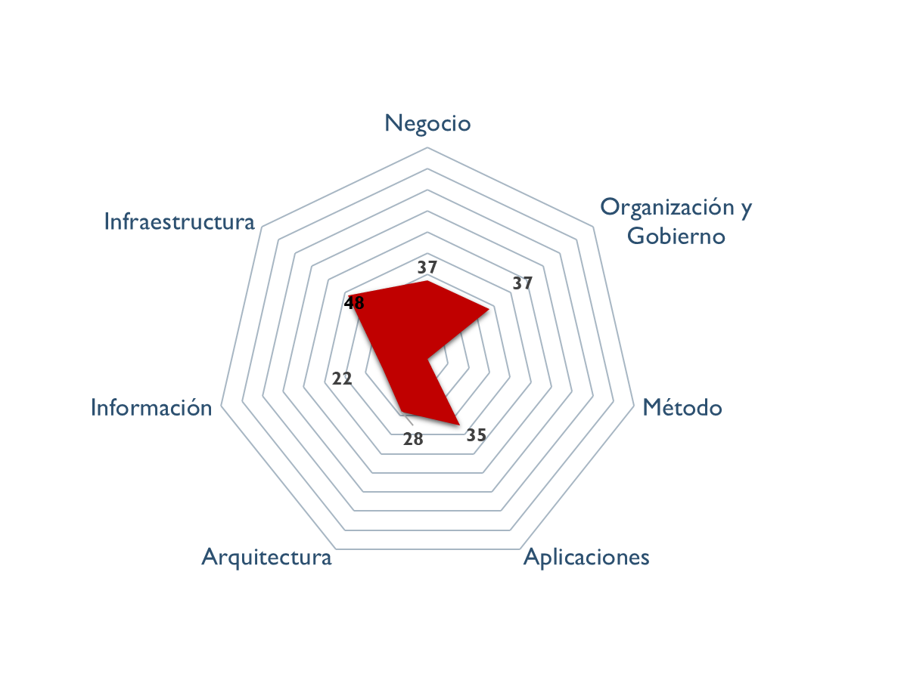

---
title: Hoja de Ruta E-Service PRY01 Gobierno SOA FNA
keywords:
- SOA
- madurez
- gobierno
- FNA
lang: en-US
date-meta: '2023-06-04'
author-meta:
- Harry Wong, ing.
- Wilson Morales, ing.
- Flavio Hernandez, ing.
- Viviana M. Martinez, ing.
header-includes: |
  <!--
  Manubot generated metadata rendered from header-includes-template.html.
  Suggest improvements at https://github.com/manubot/manubot/blob/main/manubot/process/header-includes-template.html
  -->
  <meta name="dc.format" content="text/html" />
  <meta property="og:type" content="article" />
  <meta name="dc.title" content="Hoja de Ruta E-Service PRY01 Gobierno SOA FNA" />
  <meta name="citation_title" content="Hoja de Ruta E-Service PRY01 Gobierno SOA FNA" />
  <meta property="og:title" content="Hoja de Ruta E-Service PRY01 Gobierno SOA FNA" />
  <meta property="twitter:title" content="Hoja de Ruta E-Service PRY01 Gobierno SOA FNA" />
  <meta name="dc.date" content="2023-06-04" />
  <meta name="citation_publication_date" content="2023-06-04" />
  <meta property="article:published_time" content="2023-06-04" />
  <meta name="dc.modified" content="2023-06-04T03:17:13+00:00" />
  <meta property="article:modified_time" content="2023-06-04T03:17:13+00:00" />
  <meta name="dc.language" content="en-US" />
  <meta name="citation_language" content="en-US" />
  <meta name="dc.relation.ispartof" content="Manubot" />
  <meta name="dc.publisher" content="Manubot" />
  <meta name="citation_journal_title" content="Manubot" />
  <meta name="citation_technical_report_institution" content="Manubot" />
  <meta name="citation_author" content="Harry Wong, ing." />
  <meta name="citation_author_institution" content="Arquitecto SOA, Stefanini" />
  <meta name="citation_author" content="Wilson Morales, ing." />
  <meta name="citation_author_institution" content="Software, Aplicaciones" />
  <meta name="citation_author" content="Flavio Hernandez, ing." />
  <meta name="citation_author_institution" content="SOA, Arquitectura" />
  <meta name="citation_author" content="Viviana M. Martinez, ing." />
  <meta name="citation_author_institution" content="Analista, Proyectos" />
  <link rel="canonical" href="https://hwong23.github.io/fna-dd-f2-pry1/" />
  <meta property="og:url" content="https://hwong23.github.io/fna-dd-f2-pry1/" />
  <meta property="twitter:url" content="https://hwong23.github.io/fna-dd-f2-pry1/" />
  <meta name="citation_fulltext_html_url" content="https://hwong23.github.io/fna-dd-f2-pry1/" />
  <meta name="citation_pdf_url" content="https://hwong23.github.io/fna-dd-f2-pry1/manuscript.pdf" />
  <link rel="alternate" type="application/pdf" href="https://hwong23.github.io/fna-dd-f2-pry1/manuscript.pdf" />
  <link rel="alternate" type="text/html" href="https://hwong23.github.io/fna-dd-f2-pry1/v/12f2455fcfb85360ff4845892247711b9d7896e1/" />
  <meta name="manubot_html_url_versioned" content="https://hwong23.github.io/fna-dd-f2-pry1/v/12f2455fcfb85360ff4845892247711b9d7896e1/" />
  <meta name="manubot_pdf_url_versioned" content="https://hwong23.github.io/fna-dd-f2-pry1/v/12f2455fcfb85360ff4845892247711b9d7896e1/manuscript.pdf" />
  <meta property="og:type" content="article" />
  <meta property="twitter:card" content="summary_large_image" />
  <link rel="icon" type="image/png" sizes="192x192" href="https://manubot.org/favicon-192x192.png" />
  <link rel="mask-icon" href="https://manubot.org/safari-pinned-tab.svg" color="#ad1457" />
  <meta name="theme-color" content="#ad1457" />
  <!-- end Manubot generated metadata -->
bibliography:
- content/manual-references.json
manubot-output-bibliography: output/references.json
manubot-output-citekeys: output/citations.tsv
manubot-requests-cache-path: ci/cache/requests-cache
manubot-clear-requests-cache: false
...

<small><em>Este producto PR01 ([Web](https://hwong23.github.io/fna-dd-f2-pry1/v/12f2455fcfb85360ff4845892247711b9d7896e1/))
está basada en el resultado de la consultoría "Arquitectura E-Service",
[hwong23/fna-dd-f2-pry1@12f2455](https://github.com/hwong23/fna-dd-f2-pry1/tree/12f2455fcfb85360ff4845892247711b9d7896e1)
del June 4, 2023.
</em></small>

|    **Versión** del producto 1.12f2455 del 04 Jun 2023

 

## Autores

+ **Harry Wong, ing.**
   
    · {.inline_icon width=16 height=16}
    [e_hwong](https://github.com/e_hwong)
     
  <small>
     Arquitecto SOA, Stefanini
  </small>

+ **Wilson Morales, ing.**
   
    · {.inline_icon width=16 height=16}
    [wmorales](https://github.com/wmorales)
     
  <small>
     Software, Aplicaciones
  </small>

+ **Flavio Hernandez, ing.**
   
    · {.inline_icon width=16 height=16}
    [fhernandez](https://github.com/fhernandez)
     
  <small>
     SOA, Arquitectura
  </small>

+ **Viviana M. Martinez, ing.**
   
    · {.inline_icon width=16 height=16}
    [vmmartinez](https://github.com/vmmartinez)
     
  <small>
     Analista, Proyectos
  </small>

::: {#correspondence}
✉ — Enviar mensajes a Harry Wong, ing. \<e_hwong@stefanini.com\>.

:::

 

## Objetivo del Documento
Entrega del producto 1 (PR01) del proyecto Gobierno SOA: Lista de las partes de la arquitectura actual del FNA relacionados con el Gobierno SOA, objeto del proyecto.

##  Control de Cambios {.page_break_before}
| Tema           | PRY01 Gobierno SOA FNA                                                 |
|----------------|------------------------------------------------------------------------|
| Palabras clave | SOA, E-Service, FNA, Análisis de brecha, GAP, Comparativa              |
| Autor          |                                                                        |
| Fuente         |                                                                        |
| Versión        | 1.12f2455 del 04 Jun 2023                                       |
| Vínculos       | [N003a Vista Segmento SOA FNA](N03a%a20Vsta%20aSegenta%20SOA%20FNA.md) |

 

 

***

 
    · E-Service. Fase II
 
    · PRY01 Gobierno SOA. Contenido de los Productos Contractuales
 
    · Contrato 1812020
 
    · FNA, Stefanini<
 
    · 04 Jun 2023<
 
    · **Version** 1.12f2455
 

# Producto 1: PR01. Detalle de los ítems de arquitectura impactados por el proyecto 
Lista de las partes de la arquitectura actual del FNA relacionados con el Gobierno SOA, objeto del proyecto.

**Nota**: los análisis de este producto están dirigidos a cumplir los objetivos del proyecto PRY01, Gobierno SOA: desarrollo, gestión, gobierno de arquitectura y adopción.

 

## Justificación
Facilitar la aprobación de los contenidos de los entregables del proyecto PRY01, Gobierno SOA, en su  Etapa 0, tal que garantice la continuidad y ejecución de la etapa

## Contenidos
1. Vista de segmento de la empresa, campo de acción del proyecto
1. Justificación del segmento de la empresa susceptibles de gobierno
1. Flujos críticos de trabajo sensibles al gobierno (relación con E-Service, Fase I)

 

## Criterios de Aceptación

* Lista de los ítems de los flujos críticos de trabajo sujetos al gobierno SOA
* Vista de segmento de la empresa del proyecto 1 (PRY01), Gobierno SOA FNA

 

*** 

| Tema           | Vista de Contexto: **Elementos de la Arquitectura Impactados por el Proyecto** |
|----------------|--------------------------------------------------------------------------------|
| Palabras clave | SOA, Contexto, Áreas, Procesos, Objetivos                                      |
| Autor          |                                                                                |
| Fuente         |                                                                                |
| Version        | 1.12f2455 del 04 Jun 2023                                               |
|Vínculos|[N001d. Ejecución Plan de Trabajo SOA](onenote:#N001d.sharepoint.com) [N003a. Procesos de Negocio FNA](onenote:#N003a.%20Procesos%20de%20Negocio%20FNA&section)|

 

# Vista de Contexto Fase II, E-Service, 2023 (181-2020)
## Elementos de la Arquitectura Impactados por el Proyecto
La vista de contexto o segmento de empresa presenta un corte de la arquitectura del Fondo Nacional del Ahorro (FNA, en adelante) acotada a las partes que son sujeto de trabajo de este proyecto, Gobierno SOA, Fase II, E-Service (contrato 181-2020). Si bien, la vista contiene aquellas partes directamente relacionadas con el proyecto, también presenta la relación indirecta que hay con otros ítems de la arquitectura del FNA.

 

[Imagen 1.]() Elementos de la arquitectura del FNA, la empresa, involucrados e impactados por el proyecto actual. Muestra además la relación indirecta con otras partes de la empresa, externas a la vista de contexto.

_Fuente: Elaboración propia._

 

Esta vista le informa al FNA tres objetivos importates. Primero, que el ejercicio actual, de gobierno SOA en esta caso, aunque sea de caracter empresarial está condicionada por las restricciones del proyecto presente, no puede por esto mismo abarcar a la completitud de la empresa. Por esta razón el segmento presentado en la imagen arriba hace foco en las partes que son relevantes según las restricciones de ejecución y resultados esperados de este proyecto. Segundo, la vista de contexto comunica las problemáticas y operaciones (en forma de trabajo, al final de la vista) que se deberán realizar para producir una solución esperada e los términos del proyecto, que en esta caso es de Gobierno SOA.

Tercero y último, facilita la justificación y los criterios con los que se realizó la inclusión de los ítems que en ella figuran.

 

| Tema           | Justificación Segmento Empresa FNA: **Elementos de la Arquitectura Impactados por el Proyecto** |
|----------------|------------------------------------------------------------------------|
| Palabras clave | SOA, Contexto, Áreas, Procesos, Objetivos                              |
| Autor          |                                                                        |
| Fuente         |                                                                        |
| Version        | 1.12f2455 del 04 Jun 2023                                       |
|Vínculos|[Ejecución Plan de Trabajo SOA](onenote:#N001d.sharepoint.com) [Resultados y métricas del diagnóstico de madurez SOA](onenote:#N003a.%20Procesos%20de%20Negocio%20FNA&section)|

 

## Justificación de los Ítems de Arquitectura Impactados por el Proyecto
El resultado de los diagnósticos de E-Service, Fase I, específicamente de la evaluación de madurez de SOA del FNA, y los dominios ahí analizados de Negocio, Organización y Gobierno, Método, Aplicaciones, Arquitectura, Información e Infraestructura, ubica al FNA en un nivel de madurez Nivel 2, _REALIZADO_[^1], tal que implica una operación reactiva asociada a una gestión de información en modo aislado en cuanto a las necesidades de cada área de negocio y sus sistemas de información, y que el mismo diagnóstico encuentra que el FNA incurre en soluciones específicas para demandas puntuales (Ver _Resultados y métricas del diagnóstico de madurez SOA_, en E-Service, Fase I).

[^1]: OSIMM, Realizado. El nivel 2 de madurez de OSIMM, _Realizado_, implica además que la empresa es reactiva, información en silos, y procedimientos ad hocs contrarios a procedimientos sistemáticos.

Partiendo de este resultado, se hace necesario impactar los ítems de la empresa FNA relacionados con las causas indicadas en el diagnóstico de madurez del Fondo, en pro del gobieno SOA, objeto de este proyecto, y de mejorar la calidad de las soluciones de software que están detrás y soportan a los servicios de cliente final que la entidad presta, que a su vez van en cumplimiento tanto del negocio (vicepresidencias de Crédito y vicepresidencia de Operaciones), como del marco normativo y evolución tecnológica que establece la _Política de Gobierno Digital_ del MinTIC Colombia. Por este motivo, las actividades asociadas con los procesos _(PROC4). Diseño de servicios y soluciones FNA_, y _(PROC5). Verificación y Calidad de Implementación_, constituyen elementos que habilitan en el FNA la implementación del gobierno SOA, la vigilancia de la calidad de los servicios misionales del FNA y la generación de valor.

|                             |                                  |
|-----------------------------|----------------------------------|
|  |  |

[Imagen.]() Resultados y métricas del diagnóstico de madurez SOA. Todos los dominios.

_Fuente: Diagnóstico SOA. E-Service (2022)_

 

Al igual que los procesos PROC4 y PROC5, arriba mencionados, otros elementos involucrados en el diseño del gobierno SOA del FNA son requerdidos por el proyecto. Estos otros elementos, y sus artefactos de tecnología directamente relacionados se encuentran contenidos en la vista de segmento de la empresa FNA (ver _Vista de Contexto: Elementos de la Arquitectura Impactados por el Proyecto_).

Los elementos de la vista de segmento, que como ítems impactados por el gobierno SOA, objeto de este proyecto, ameritan ser resaltados son las capacidades de negocio del FNA: Gestión de Tecnología para Negocio, y Gestión de Productos y Funcionalidades (ver imagen abajo), son de importancia por su directa relación con los procesos PROC4 y PROC5, incluidos con anterioridad en el segmento de la empresa a trabajar, y porque además, estas unen a los procesos con los servicios más relevantes para esta etapa del diseño del gobierno del FNA. La imagen siguiente demuestra esta relación entre los procesos y los servicios SOA del FNA relacionadas con las capacidades que el gobierno FNA busca impactar.

 

[Imagen.]() Capacidades de negocio FNA que el gobierno SOA del FNA, objeto de este proyecto, busca impactar.

_Fuente: Diagnóstico SOA. E-Service (2022)_

 

Todos los elementos de la empresa contenidos en la vista de contexto, o segmento de la empresa FNA, serán abordados en el periodo de tiempo establecido para el ejercicio del proyecto, esto es, _dos meses_, contados desde la firma del inicio de proyecto, y con el equipo de trabajo presentado para la ejecución del presente proyecto (PRY01).

 

## Descripción de los elementos de la vista de segmento

La vista de segmento que define los ítems de arquitectura del FNA a ser abordados en esta etapa del proyecto; comprenden los siguientes
elementos.

1. Los procesos de _Diseño de Servicios y Soluciones FNA** y **Verificación y Calidad de Implementación_
1. Los objetivos representados en el gobierno y adopción de la arquitectura
1. Los servicios derivados del _Diseño de Servicios y Soluciones FNA_ y _Verificación y Calidad de Implementación_
1. La infraestructura tecnológica que soporta los servicios

 

### Diseño de Servicios y Soluciones FNA
El diseño de servicios y soluciones, constituye una competencia a desarrollar y madurar al interior del FNA, en concordancia con las recomendaciones de los marcos de referencia: _e-Competence Framework (e-CF)—A common European Framework for ICT Professionals in all industry sectors—Part 1: Framework, 2016_
en los cuales la etapa de diseño está alineada con los requisitos de los servicios demandados por los interesados, su posterior desarrollo, la adquisición o contratación y el gobierno que se hace necesario implementar para soportar la operación:

* Gestión de la configuración
* Preparación y ejecución de pruebas
* Gestión de Requisitos y Mantenimiento
* Atención de problemas
* Atención de incidentes

El Diseño de Servicios y Soluciones, garantiza una prestación ágil y escalable de servicios y soluciones digitales del FNA, además de oportunas y
rentables, capaces de apoyar los objetivos trazados en la vista de segmento de esta estapa del proyecto.

Estas soluciones digitales pueden adoptar varias formas, desde aplicaciones móviles, plataformas en línea, software personalizado,
y sistemas de gestión empresarial, entre otros.

Por otra parte y en articulación al Marco para la Transformación Digital del Estado Colombiano, del **MinTIC**, el diseño de servicios y
soluciones, integra habilidades del FNA, orientadas principalmente a:

* Diseño con enfoque centrado en los usuarios, (ciudadanos)
* Solución de problemas complejos a través de la Innovación
* Diseños Ágiles desde la perspectiva de salida a producción y con un adecuado uso de recursos

Estos elementos y características, corresponderán a los atributos del proceso ** Diseño de Servicios y Soluciones FNA **, de la vista de segmento
del FNA.

### Verificación y Calidad de Implementación

Este componente dentro de la vista de arquitectura de segmento, define el éxito del diseño de servicios y soluciones, debido a la consideración
de buenas prácticas, cumplimiento de normas y un adecuado gobierno en la etapa de diseño, hasta llegar a la implementación y puesta en funcionamiento.

La **Verificación y Calidad de Implementación** dentro de la arquitectura de segmento, asegura que el diseño tuvo una planificación adecuada, un
equipo de trabajo con las competencias necesarias, una comunicación acertiva, un modelo de desarrollo y ejecución de pruebas, un mecanismo gradual de
implementación, las respectivas capacitaciones, los requerimientos de seguridad y privacidad y la generación de hábitos y comportamientos a través del
uso y apropiación de la solución desplegada.

Lo anterior sugiere los niveles de actuación de un gobierno; **Gobierno SOA**

Dentro del alcance de esta fase del proyecto, se contempla el diseño del Gobierno SOA, compuesto por elementos con
líneas de actuación en completa articulación; los resultados de uno, impactan los resultados y el accionar de los demás.

Estos elementos que se relacionan a continuación:
 
* Procesos
* Estructura
* Habilidades y Competencias
* Políticas
* Cultura y Ética
* Infraestructura
* Elementos de Información

 

### Desarrollo de Arquitecturas FNA
Dentro del dominio motivacional; una de las metas claves de la vista de segmento corresponde al desarrollo de arquitecturas, como
elementos rectores de gobierno de los procesos: **Diseño de Servicios y Soluciones FNA** y **Verificación y Calidad de Implementación**

De acuerdo al Marco de Referencia de Arquitectura Empresarial - **MRAE** del MinTIC es necesario generar una articulación entre: las iniciativas que se generan desde los dos procesos que son parte del alcance de esta fase; la ejecución de los proyectos que se generaron a partir de aquellas iniciativas; y una gestión y monitoreo de los impactos de la finalización de los proyectos y los productos que 
entregan a nivel de servicios.

A través de la práctica de arquitectura, el FNA empieza a generar un gobierno del diseño y posterior implmentación de los servicios y soluciones digitales que presta a los ciudadanos.

### Gestión de Arquitectura FNA
Este componente está orientado a la instauración del Gobierno de Arquitectura; con los elementos que lo componen: procesos, estructura, habilidades y competencias, políticas, cultura y ëtica, y elementos de información.

Es un objetivo a cumplir para los procesos definnidos en esta fase: _Diseño de Servicios y Soluciones FNA_ y _Verificación y Calidad de Implementación_.

 

| Tema           | Flujos Críticos de Trabajo FNA: **Elementos Susceptibles de Gobierno en el FNA**  |
|----------------|-----------------------------------------------------------------------|
| Palabras clave | SOA, Flujos críticos, Procesos, Gobierno                              |
| Autor          |                                                                       |
| Fuente         | Elaboración propia                                                    |
| Version        | 1.12f2455 del 04 Jun 2023                                      |
| Vínculos       | [N001d. Ejecución Plan de Trabajo SOA](onenote:#N001d.sharepoint.com) [N003a. Procesos de Negocio FNA](onenote:#N003a.%20Procesos%20de%20Negocio%20FNA&section) |

 

# Flujos Críticos Susceptibles de Gobierno FNA

***

# Anexos del Producto 1 (PR01)
## 1. Vista de Segmento del Proyecto

[Imagen 1.]() Los ítems de la arquitectura del FNA objeto del trabajo de la Fase II de E-Service, 2023.

_Fuente: Diagnóstico SOA. E-Service (2022)_

 

## 2. Servicios SOA del FNA Vista de Segmento  del Proyecto
Por lo anterior, los servicios SOA del FNA más relevantes según los modelos son los indicados a continuación. De igual manera que para el Fondo, estas partes de la empresa son importantes para futuros diagnósticos y gobierno SOA.

| **Capacidades FNA**                 | **Parte Relacionada**              | **Tipo**                  |
|-------------------------------|------------------------------------|---------------------------|
| Desarrollo de nuevos negocios | AS026-Gestión de Autenticación     | **application-service**   |
|                               | AS034-ConsultarestadocuentaCartera | **application-service**   |
|                               | ASXX3-RegistrarRecaudoObligacion   | **application-service**   |
|                               | COBIS                              | application-component     |
|                               | Servicios COBIS                    | application-collaboration |
| Entrega de Productos          | AS026-Gestión de Autenticación     | **application-service**   |
|                               | AS034-ConsultarestadocuentaCartera | **application-service**   |
|                               | ASXX3-RegistrarRecaudoObligacion   | **application-service**   |
|                               | COBIS                              | application-component     |
|                               | Servicios COBIS                    | application-collaboration |
| Gestión de Cliente            | AS026-Gestión de Autenticación     | **application-service**   |
|                               | AS034-ConsultarestadocuentaCartera | **application-service**   |
|                               | ASXX3-RegistrarRecaudoObligacion   | **application-service**   |
|                               | COBIS                              | application-component     |
|                               | Servicios COBIS                    | application-collaboration |
| Servicios de Cuentas          | AS026-Gestión de Autenticación     | **application-service**   |
|                               | AS034-ConsultarestadocuentaCartera | **application-service**   |
|                               | ASXX3-RegistrarRecaudoObligacion   | **application-service**   |
|                               | COBIS                              | application-component     |

_Fuente: Diagnóstico SOA. E-Service (2022)_

## 3. Lista de Fases y Entregables del Proyecgto 1 (PRY01), Gobierno SOA
|        | PRY01. Gobierno SOA                                                                    |
|--------|----------------------------------------------------------------------------------------|
| Fase 0 | PR01. Detalle de los ítems de arquitectura impactados por el proyecto                  |
|        | PR01.1. Aprobación de inicio y personal FNA asignado Gobierno SOA                      |
| Fase 1 | PR02. Detalle de los recursos, herramientas, roles y participantes del gobierno SOA    |
|        | PR03. Diseño de los procesos y responsabilidades del comité de gobierno                |
| Fase 2 | PR04. Definición de roles y responsabilidades y selección e instalación del comité     |
|        | PR05. Procesos de mejoramiento de diseño y vigilancia de riesgos técnicos              |
| Fase 3 | PR06. Modelos actualizados de los ítems de arquitectura impactados por el proyecto     |
| Fase 4 | PR07. Métricas de efectividad del gobierno                                             |
| A      | Generar lineamientos y políticas de gobierno SOA                                       |
|        | Aplicar y fortalecer gobierno SOA en el FNA                                            |
|        | Medir las decisiones de arquitectura y del proceso de desarrollo de las soluciones SOA |

 

***

>    E-Service. Fase II

>    PRY02. Recursos, Herramientas, Roles Gobierno SOA. Contenido de los Productos Contractuales

>    Contrato 1812020

>    FNA, Stefanini

>    FECHA_COMPILACION
>
>    **Version** COMMIT

# Producto 2: PR02. Detalle de los recursos, herramientas, roles y participantes del gobierno SOA
Políticas y procedimiento, paquetes de trabajo, identificación de personas, roles y herramientas a desplegar a cargo de la oficina de arquitectura del FNA por concepto de la instauración del gobierno.

**Nota**: los análisis de este producto están dirigidos a cumplir los objetivos del proyecto PRY01, Gobierno SOA: desarrollo, gestión, gobierno de arquitectura y adopción.

 

## Justificación
El resultados del análisis de riesgos técnicos realizado en la Fase I de la consultoría E-Service, causados en parte por los retos de complejidad y agilidad que enfrenta el FNA, los cuales configuran una red de aplicaciones y servicios que aumenta el impacto, el esfuerzo y la incertidumbre de los cambios en las arquitecturas del Fondo, obliga a crear la oficina de arquitectua del FNA y a desplegar las mejoras en los flujos críticos de trabajo a cargo esta.

## Contenidos
1. Modelo de gobierno SOA del FNA: actores, información y procedimientos
1. Flujo de trabajo de oficina de arquitectura del FNA
1. Matriz de responsabilidades oficina de arquitectura
1. Procedimientos base del modelo de gobierno / oficina de arquitectura
1. Anexos. Referencia documental del Gobierno SOA del FNA

 

## Criterios de Aceptación
* Entendimiento funcional y operativa de la oficina de arquitectura FNA
* Matriz de roles y procedimientos de la oficina de arquitetura FNA

 

*** 

# Elementos de Gobierno
El gobierno SOA del FNA, objeto de este proyecto, tiene impacto sobre partes e ítems seleccionadas de la arquitectura de software y de servicios del FNA, respectivamente (ver vista de contextual, segmento de la empresa). El impacto de este gobierno se extiende a actores principales, interesados, usuarios y entidades relacionados con aquellas partes de la arquitectura del FNA.

## Objetivo del Gobierno SOA del FNA
El FNN ha establecido como pilar tecnológico el Gobierno SOA tal que permita la continuidad de servicio, identificar las amenazas y riesgos que pueden impactar el desarrollo y la gestión de las arquitecturas de software del Fondo; tarea base para la generación de planes enfocados a la alienación y puesta marcha de futuras soluciones y mejoras de las actuales.

## Análisis de Impacto en las arquitecturas (AIA) del FNA
El análisis de impacto en el negocio BIA (Business Impact Analisys) permite la evaluación de cada componente, para determinar cuáles de ellos son críticos para la continuidad del servicio y es la base para la creación del Plan de Continuidad. 

Todas las etapas asociadas a este análisis se han documentado en la Matriz de Análisis BIA. A continuación, los resultados claves para el plan de continuidad del servicio.

Los pasos para el análisis BIA son: 
 
Identificación de los componentes (CCF).
Identificación del calendario crítico para la operación de cada componente (picos de operación y épocas en las que su funcionamiento es indispensable).
Identificación de las dependencias e interacciones críticas para cada componente.
Análisis del impacto Financiero, Reputacional, Legal o al Usuario de la ausencia del componente en la línea de tiempo.
Tiempo Objetivo de Recuperación (RTO) para cada componente.
Identificación de los recursos mínimos para operar en contingencia.
Determinación del Punto Objetivo de Recuperación (RPO)
 
### Flujos Críticos de Trabajo

### Gestión del Riesgo Técnico

### Definición de Estrategias de Contingencia
Las estrategias de contingencia se establecen para cada riesgo crítico analizado, contemplando para ello las redundancias existentes y los requisitos de seguridad que deben mantenerse en observación durante la materialización del riesgo y la recuperación a la normalidad.

## CCF

| CCF                |     |
|--------------------|-----|
| Cliente destino:   | _Guía: escoger únicamente un cliente objetivo a quien se va a solucionar el problema de gobierno_ |
| Producto/Servicio: | _Guía: escoger únicamente un producto o servicio del cliente a quien se va a solucionar el problema_ |

### Atención
_Guía: por dónde llega o inicia el flujo. Ejemplo: puede ser un departamento, persona, sistema público o canal por donde llega la petición de inicio del flujo._

### Petición
_Guía: En qué medio, dispositivo, o soporte queda almacenada la petición (correo, documento, forma, web, sistema, etc); cuál es y de qué tipo es la petición que ejecuta este flujo._

### Arquitectura
_Guía: ¿qué pasa después de que el arquitecto, ingeniero, o receptor recibe la petición. Si distribuye, o hace una propuesta, análisis, reunión, etc._
- paso 1
- 2
- 3
- 4

### Valor
_Guía: cuál es el valor que este flujo genera para el FNA._

### Seguimiento
_Guía: cómo se valida que la ejecución o valor gnerado se haya llevado a cabo en dichos términos._

### Entrega
_Guía: cómo se da por entregado el resultado del trabajo al cliente objetivo que inició el flujo._

### Repetición
_Guía: qué es necesario realizar al flujo para que asegurar que el cliente objetivo quiera ejecutarlo nuevamente._

## CCF
_Guía: mantener el nivel de detalle sencillo, los menos cantidad de pasos; incluya únicamente lo que permita entender el flujo en una sola página de lectura._

 

| CCF                |     |
|--------------------|-----|
| Cliente destino:   | _Guía: Fondo Nacional del Ahorro 
| Producto/Servicio: | _Guía: Biometria 

### Atención
El consumidor financiero del FNA, se acerca a los puntos de atención para retiro de cesantias y/o AVC dentro del proceso se le capturan las huellas por dónde llega o inicia el flujo. 
### Petición
_Guía: Los registros de biometria son entregados por el operador biometrico a traves de correo electronico al usuario lider del area 

### Arquitectura
_Guía: ¿qué pasa después de que el arquitecto, ingeniero, o receptor recibe la petición.
 al presentar fallas del servicio, se realizar mesa técnica para verificar el estado de los componentes de arquitectura, aplicación , redes, Etc 
- paso 1 cobis envia un ID al operador biometrico 
- paso 2 el operador biometrico responde el ID 
- paso 3 El operador levanta el servicio 
- paso 4 El aplicativo core envía la petición de biometria 
- el operador biometrico responde con un hit o no hit (hit que quiere decir que la persona es quien dice ser, no hit no es quien dice ser)

excepcion  de los casos de uso
exhaustividad de las pruebas  
la confiabilidad de las pruebas
Malla de calidad de las pruebas
 

fortalecimiento de diseño 
categoria: Alta 
caso de uso: excepciones 

### Valor

El valor es alto, debido a que afecta al Consumidor financiero en el retiro de las cesantias 

### Seguimiento
El seguimiento se realiza diariamente con la conciliacion aplicada por el area usuaria 

### Entrega
el resultado del trabajo será, la implementacion de herramientas de gobierno que permitan el fortalecimiento en el diseño para la aplicacion 

### Repetición
_Guía: Implementar un buen diseño en la aplicacion y malla de calidad en la pruebas 

## Referencias {.page_break_before}

<!-- Explicitly insert bibliography here -->

